# Motion Matching + GAS（UE 5.8 RootMotion 驱动）— 技术方案

| 关联任务 | 文档性质 | 状态 | 创建 | 更新 |
|----------|----------|------|------|------|
| [Motion Matching 基础移动与 GAS 动作系统（UE 5.8 RootMotion）](../plan/motion-matching-gas-action-system.md) | UE 5.8 主力工程目标架构 | 📝 提案 | 2026-09-07 | 2026-09-12 |

## 1. 文档定位

本文面向 `F:/ProjectAI/Sekiro5.8` 这一 UE 5.8.2 主力开发工程，在 GAS 动作所有权、Lua 编排和 Classic 回退约束下，提出一套 RootMotion Motion Matching 架构。

本项目由 UE 5.2 工程复制为独立的 UE 5.8 工作目录。本文取代本项目中复制进来的旧版方案；独立旧项目 `F:/ProjectAI/Sekiro` 仍保留原 UE 5.2 方案作为历史基线。

- 不修改独立旧项目 `F:/ProjectAI/Sekiro` 的 UE 5.2 决策、任务状态和实施记录；
- 本项目已有 `BP_SekiroMotionMatching`、`ABP_SekiroMotionMatching` 和最小数据库是迁入基线，允许在本项目原位适配，但未经 UE 5.8 复验不能视为已完成；
- 本项目的 Classic 角色、旧 Lua 动画状态机和现有关卡继续作为回退基线，不随 Motion Matching 适配被删除或重定向；
- UE 5.8.2 API 适配、资产重建和运行时验证必须在本项目独立记录；
- 本文只定义目标架构、所有权、数据流、门禁和验收方法。

### 1.1 当前迁入基线与首个实施切口

截至 2026-09-09，工程已经具备轨迹组件、Motion Matching AnimInstance、Lua AnimGraph 和单一 Minimal Database 接线，但尚未形成本文要求的语义闭环。正式载体固定为 `/Game/Characters/SekiroMotionMatching/ABP_SekiroMotionMatching`，其 AnimGraph 由 `Content/Script/Animation/SekiroMotionMatching/**` 全量描述；不再把临时 Probe 或手工图当作最终实现。

实施顺序按《CMC驱动的MotionMatching完整流程》的运行时因果链重排，但把示例的 CMC 水平位移权威替换为本项目的动画 RootMotion 权威：

```text
本帧事实快照
  → 历史/当前/未来 Trajectory
  → Locomotion 语义状态
  → Chooser 合法数据库集合
  → PoseHistory Provider + Schema BuildQuery
  → Continuing Pose / 候选搜索
  → PostSelection + Blend Stack
  → 最终 PoseHistory
  → 动画 RootMotion 协调与 CMC 单次消费
  → 下一帧实际结果反馈
```

当前实现已移除旧 `bForceMotionMatchingInterrupt` 兼容投影，搜索控制统一为 Generation + Pending 的持久请求，并由 PostSelection 与后续 CMC 实际状态确认。手动 Interrupt 只作为 `PublishedSearchRequest.bForceSearch` 的显式输入，不再形成第二份 AnimGraph 状态。只有 Idle/Start/Run/Stop 最小闭环达到用户明确授权的对应门禁后，才进入 Pivot、Locked、GAS Owner Token 和视觉后处理。Classic 的 `AddMovementInput` 入口继续作为回退系统保留，但 Motion Matching 角色必须在装配和调用链上与其隔离。

## 2. 不可违反的核心前提

### 2.1 水平位移由动画 RootMotion 唯一生成

本项目的基础 Locomotion 不采用 Game Animation Sample 2 的 Capsule Driven Movement Model：

- 玩家或 AI 输入只产生移动意图、目标步态和目标朝向；
- 未来轨迹只用于 Motion Matching 查询，不是移动命令；
- CMC 的速度、加速度、`MaxWalkSpeed` 不得反向决定地面 Locomotion 的水平位移；
- 每帧水平位移距离、速度曲线、起步、减速、停止和 Pivot 路径均来自最终选中动画的 RootMotion；
- `UCharacterMovementComponent` 仍负责消费最终 RootMotion、胶囊碰撞、台阶、坡面、MovementMode、重力和网络移动基础，但它不是水平 Locomotion 位移的生成者。

本文后续出现的“预测速度”都表示查询意图，不表示 CMC 将实际执行该速度。

### 2.2 搜索前不能依赖本帧尚未选中的 RootMotion

Motion Matching 候选动画都可以带 Root Motion，但运行时不在同一帧迭代求解“先选动画还是先有轨迹”。本帧 Desired Trajectory 的输入只能是：

- 当前 MoveIntent、RequestedGait、RotationMode 和 Facing 意图；
- 上一轮 RootMotion 已经由 CMC 消费、碰撞约束后得到的实际 Transform 与速度；
- 与具体候选无关的预测参数，例如按 Gait 配置的加减速时间、转向响应和离线统计标称速度。

它不能读取本帧尚未选中的 `SelectedAsset` 或该资产未来 Root Motion。候选动画自己的未来 Root Motion 已在数据库构建阶段编码为特征向量；运行时只把独立生成的 Desired Query 与这些候选向量比较。

```text
ActualState(N) + Intent(N) + GaitProfile
    → DesiredTrajectory(N)
    → 与数据库中各候选的离线 RootMotion Trajectory 特征比较
    → SelectedPose(N)
    → Evaluate 提取 RootMotionDelta(N)
    → CMC 消费并处理碰撞
    → ActualState(N+1)
```

因此本系统是逐帧闭环控制，不是同帧循环方程。选错、碰墙或动画实际位移与意图存在误差时，由 `ActualState(N+1)` 和新的 PoseHistory 在下一帧修正搜索。

### 2.3 RootMotion 只能有一个最终提交链

任意一帧只能存在一个最终 RootMotion 结果提交给 CharacterMovement：

```text
选中的 Locomotion 动画或全身 GA Montage
    → 动画提取 RootMotion
    → 项目 RootMotion 协调器执行一次方向/旋转修正
    → CharacterMovement 消费一次
    → Actor Transform 成为下一帧真实历史
```

禁止在同一帧同时执行：

- Lua `SetActorRotation` / `ApplyActorYaw`；
- CharacterMovement 自动朝向；
- 旧 RootMotion 水平重定向；
- 新 RootMotion Steering；
- Offset Root Bone 对胶囊位移的二次补偿。

### 2.4 Motion Matching 负责选择，Gameplay 负责合法性

Motion Matching 只在 Gameplay 已允许的候选集合中比较连续特征。它不得用数学代价代替以下规则：

- Idle 时不能选 Run Loop；
- Run 请求时不能继续把 Idle 当作合法 Continuing Pose；
- Start、Loop、Stop、Pivot、Land 属于不同语义阶段；
- 全身 GA 拥有 RootMotion 时，Locomotion 不能同时贡献第二份位移；
- 攻击、闪避、处决、Traversal 等确定性动作继续由 GA/Montage 选择。

## 3. 与 UE 5.8 Game Animation Sample 2 的取舍

| Sample 2 机制 | 本方案 | 说明 |
|---------------|--------|------|
| CMC/Mover 生成实际运动 | 不采用 | 实际水平运动由动画 RootMotion 生成 |
| GenerateTrajectory | 改造后采用 | 历史取上一轮 RootMotion 实际结果；未来由 MoveIntent 与独立 Gait Profile 预测，不依赖本帧选择 |
| Pose History | 采用 | 保存实际输出姿势历史，供 Pose Channel 查询 |
| UpdateStates | 采用 | 整理语义状态，但状态源适配 RootMotion 闭环 |
| Chooser 多库过滤 | 采用 | Gameplay 先决定合法数据库，搜索不能跨越语义门禁 |
| Motion Matching + Blend Stack | 采用 | 只在 Chooser 输出的数据库数组内选具体时间点 |
| PostSelection | 采用并增强 | 缓存所选库/动画/阶段，并确认待处理的切换请求 |
| Orientation Warping / Steering | 有条件采用 | 只修正姿势或最终 RootMotion 方向，不生成额外位移 |
| Offset Root Bone Translation | 默认不采用 | RootMotion 已推动胶囊，继续累计平移偏移容易形成双重补偿 |
| Offset Root Bone Rotation | 默认关闭，单独门禁 | 仅在确认不会与 RootMotion Steering 重复旋转后试验 |
| Leg IK | 采用 | 只修正最终骨骼姿势，不改变胶囊位移 |
| Traversal Motion Warping | 仅 GA 使用 | 只在显式目标和动画窗口内变换 Montage RootMotion |

## 4. 总体运行时架构

```mermaid
flowchart LR
    Input[玩家输入 / AI 意图] --> Intent[MoveIntent 与 DesiredFacing]
    Intent --> Future[RootMotion Intent Trajectory Predictor]
    Actor[CMC 约束后的 Actor Transform] --> History[RootMotion 实际历史]
    Future --> Trajectory[查询轨迹]
    History --> Trajectory

    Intent --> States[Update Locomotion States]
    Actor --> States
    Selection[上一帧 PostSelection] --> States
    GAS[GAS 动作与阻塞标签] --> States

    States --> Chooser[Chooser 数据库门禁]
    Chooser --> Databases[合法 Pose Search Databases]
    Trajectory --> Provider[Trajectory / PoseHistory Provider]
    PoseHistory[上一轮最终 Pose History] --> Provider
    Provider --> Query[Schema BuildQuery]
    Query --> MM[Continuing Pose + Candidate Search]
    Databases --> MM
    MM --> Selection

    MM --> BasePose[Locomotion Base Pose]
    GAS --> Slots[UpperBody / FullBody Montage]
    BasePose --> Slots
    Slots --> Visual[Orientation / Leg IK]
    Visual --> Extract[提取动画 RootMotion]
    Intent --> Coordinator[RootMotion Coordinator]
    Extract --> Coordinator
    Coordinator --> CMC[CharacterMovement 消费、碰撞与地面约束]
    CMC --> Actor
```



这个闭环中只有 `Coordinator → CMC → Actor` 改变角色位置。Trajectory、Chooser、Motion Matching 和 Warping 都不能绕过该链直接写 Actor Transform。

### 4.1 Update 与 Evaluate 的帧时序

图面连线不能直接代表 AnimGraph 的调用顺序。正式 AnimGraph 必须让 Pose Search History Collector 作为外层节点包住 Motion Matching：

```text
帧 N · Update
  1. 读取本帧最新意图、MovementMode、实际 Transform/速度与上次 PostSelection
  2. 更新历史—当前—未来 Trajectory
  3. 更新 Phase/Gait/Mode/Stance 等语义
  4. Chooser 输出合法数据库数组并设置到 Motion Matching
  5. Collector 先发布 PoseHistory Provider，再进入 Motion Matching Update
  6. BuildQuery 使用本帧 Trajectory + 上一轮 Evaluate 的最终 PoseHistory

帧 N · Evaluate
  7. 搜索结果驱动 Standalone Blend Stack；当前逐 Sample 子图为可裁剪的无操作直连，各 Player 直接评估后由外层栈合成最终 Pose
  8. Collector 在 Source Evaluate 完成后记录本帧最终混合姿势
  9. 从最终动画结果提取 RootMotion，经 Coordinator 后由 CMC 消费一次

帧 N+1
  10. CMC 约束后的 Actor 结果进入新的实际历史；帧 N 最终 Pose 成为新的 PoseHistory
```

Trajectory 使用本帧事实，不额外晚一帧；PoseHistory 只能保存上一轮已输出姿势，这是反馈闭环的正常语义。不得通过把输入也延后一帧来“对齐”二者。

### 4.2 各层只回答一个问题

| 层 | 只回答 | 不负责 |
|----|--------|--------|
| CMC/Actor 快照 | 角色实际发生了什么 | 选择动画、生成第二份基础水平位移 |
| Trajectory | 过去怎样移动、未来希望怎样移动 | 直接移动 Actor |
| 语义状态 | 当前属于哪个 Phase/Gait/Mode/Stance | 指定某个动画资产 |
| Chooser | 哪些数据库合法 | 选择 PoseIdx/时间 |
| Schema/BuildQuery | 如何把轨迹与姿势变成可比较向量 | 绕过门禁扩大候选集 |
| Motion Matching | 合法候选中哪个总代价最低 | 决定 Gameplay 合法性 |
| Blend Stack | 如何从旧样本平滑过渡到新样本 | 生成额外胶囊位移 |
| Collector | 记录最终输出姿势供下一帧查询 | 缓存输入意图 |
| RootMotion Coordinator/CMC | 唯一协调、消费并约束最终位移 | 反向改写查询选择 |

## 5. 输入与 RootMotion 意图轨迹

### 5.1 输入输出

输入层发布纯意图快照：

```text
MoveIntentWorldDirection
MoveIntentAmount
RequestedGait
RequestedStance
DesiredMoveYaw
DesiredFacingYaw
RotationMode
IntentGeneration
```

输入层不得调用 `AddMovementInput` 来产生地面水平位移，也不得在 Motion Matching 角色上直接修改 ActorYaw。

### 5.1.1 正式输入与查询快照契约（重写第一项）

本契约是新实现的依据，不以旧 Motion Matching C++、Lua 或蓝图接口兼容为目标。已有代码仅在符合契约时复用；继续使用原正式资产与源码位置，不建立平行系统。当前 Intent、ActualState 与 QuerySnapshot 已按该边界实现。

**输入意图 `Intent`**：玩家或 AI 经 Lua 编排后，在游戏线程一次性提交完整值。C++ 接口负责校验、规范化和保存，不从当前选中动画推导意图。

| 字段 | 契约 |
|------|------|
| MoveIntentWorldDirection | 世界 XY 平面的单位方向；零输入时为零向量，不包含输入强度 |
| MoveIntentAmount / bHasMoveIntent | 强度限定 0–1；统一应用一次配置死区，无效方向或死区内输入统一输出强度 0、方向零向量和 false |
| RequestedGait / RequestedStance | 请求的步态与姿态，不冒充已生效的状态；释放输入不把 RequestedGait 改成 Idle，静止由后续 Phase 表达 |
| DesiredMoveYaw | 有移动意图时从规范化世界方向派生，单位度；无意图时保留最后有效值，仅供参考，不能据此产生位移 |
| RotationMode / DesiredFacingYaw | 面向策略与有限世界角度；Free 有输入时使用移动方向，Free 无输入时保持最近实际朝向，Locked 使用有效锁定目标方向，目标丢失时明确退回 Free |
| IntentRevision | 规范化意图变化时递增的版本号，重复提交相同内容不递增；连续方向变化不等于必须强制重搜 |

旧字段名 `IntentGeneration` 在重写时由职责明确的 `IntentRevision` 取代。它不是后续 Search Request 的 Generation；请求代数只由语义与搜索协议推进，不因每次连续摇杆变化而不断作废待确认请求。具体枚举和变化容差在实现这份契约时集中定义，不分散到各消费者。

输入层通过唯一的移动档位决策入口同时发布两个独立持久字段：`RequestedMotionMatchingGait` 与 `RequestedMotionMatchingStance`。兼容字段 `CurrentMovementTier` 继续服务 Classic 速度上限、摄像机和旧逻辑，但 Movement Lua 构造正式 Intent 时不得再从它反推 Gait，也不得从角色已经实现的 `bIsCrouched` 反推 Stance。`Idle` 只表达当前无移动输入，不能覆盖上次请求；`Crouch` 只改变 Stance，Walk/Run/Sprint 明确发布对应 Gait 并恢复 Standing。这样输入请求先于 CMC 实际姿态生效，同时不增加第二套 Lua 状态或平行提交接口。

**实际状态 `ActualState`**：C++ 移动反馈边界发布最近一次已完成的移动结果，包含 `ActualSampleId`、采样时间、`ActorTransformWS`、`ActualVelocityWS`、实际 MovementMode，以及该步实际位移和被约束位移。速度取该已完成移动步骤的 CMC 结果；位移差分作为独立诊断值，不与速度字段混用。初始化可从当前 Actor 建立基点，但必须标记尚无完成的移动反馈；传送、换 Pawn 或时间不连续时重置历史，不能跨断点差分。

传送与网络修正统一调用 `RebaseMotionMatchingActualState()`：清空修正前的新旧两套轨迹历史，从校正已经落地后的 Actor Transform、CMC Velocity 和 MovementMode 立即发布一个递增 SampleId 的有效基线，并把该基线的实际位移与裁剪量固定为零。`OnTeleported` 在父类更新地面状态后立即 Rebase；自主客户端的 `OnClientCorrectionReceived` 因发生在位置应用之前只登记请求，下一次 Movement Tick 开始时 Rebase；模拟代理的 `SmoothCorrection` 在父类更新胶囊后直接 Rebase。未经过这些入口的世界位置跳变仍由完成移动回调的起点连续性检查兜底。只有 Owner/Movement/World 或数值本身非法时才进入无效状态，不能把网络校正距离记作动画 RootMotion。

**查询快照 `QuerySnapshot`**：游戏线程的统一快照构建入口读取最新完整 Intent、最近完成的 ActualState 和独立 GaitProfile，形成一次不可分割的纯值发布。

| 字段 | 契约 |
|------|------|
| QueryRevision / IntentRevision / ActualSampleId | 分别标识本次构建、使用的意图版本与实际样本；不假设三者相同，也不直接当作搜索确认代数 |
| Intent / ActualState | 本次使用的值副本；下游不得再逐字段读取 MovementComponent 或 Lua 拼接另一份状态 |
| GaitProfileRevision / TargetIntentVelocityWS | 记录配置版本；目标速度统一由 GaitProfile 的标称速度 × 输入强度 × 世界方向计算，单位 cm/s |
| PredictedFutureVelocityWS / PredictedFuturePlanarSpeed | 同一次未来积分末端的世界水平速度及模长；供状态层判断轨迹实际预测出的移动趋势，不从已旋转到 Query 空间的采样点反推 |
| ExpectedSpeed | TargetIntentVelocityWS 的水平模长；是查询目标速度，不是实际速度、预测当前速度或 CMC 移动命令 |
| QueryOriginWS / DesiredTrajectory | 明确同一次构建的查询原点与轨迹；世界到查询空间的转换只在统一边界执行一次 |
| bValid / InvalidReason | 缺组件、缺步态配置或非法关键数值时显式标记无效；下游不得把无效数据或旧轨迹当成有效新查询 |

轨迹预测与 AnimInstance 必须消费同一个目标速度，禁止 AnimInstance 再从 WalkSpeed/RunSpeed/SprintSpeed 重算。释放输入时 ExpectedSpeed 为零，但实际速度和未来减速段仍可非零；不得把三者混为“角色已经停止”。非地面模式保留真实 MovementMode，不套用地面预测公式冒充有效轨迹。

发布应发生在本次动画查询使用数据之前，使用此时最新的完整输入以及最近一次完成的移动结果；“最近完成”不要求与输入具有同一引擎帧号。具体 UE 调用挂点后续单独核对，不能仅靠组件 Tick 前置关系宣称满足时序。AnimInstance 只复制快照到动画消费边界，工作线程不访问 Lua、Pawn 或组件；并行动画读取期间不得原地修改它正在消费的数据。

本节只定义并记录 Intent、ActualState 与 QuerySnapshot 边界；Phase、Chooser、Search Request、PostSelection 和 RootMotion 消费仍由后续章节各自拥有，不在事实快照中反向选择动画或生成资产。

### 5.2 轨迹的历史部分

历史轨迹必须在 CharacterMovement 完成 RootMotion 消费后，从真实 Actor Transform 回采：

- 平面位置和旋转来自 Actor 的实际移动结果；
- 历史速度由固定时间间隔的 Transform 差分得到；
- 碰墙、上坡、下坡或 RootMotion 被裁剪后，历史必须记录裁剪后的实际结果；
- 不使用动画原始 RootMotion 曲线替代实际历史，否则查询看不到碰撞造成的偏差；
- 对不稳定帧间隔使用时间戳差分和滤波，不能假设每帧固定 DeltaTime。

### 5.3 轨迹的未来部分

未来轨迹是“希望后续动画怎样移动”，必须在搜索前独立生成。它由 MoveIntent、当前实际状态和 RequestedGait 对应的 `GaitProfile` 预测，而不是由本帧未知候选动画预测：

```text
NominalSpeed = GaitProfile.NominalSpeed(RequestedGait)
TargetIntentVelocity = MoveIntentWorldDirection × NominalSpeed × MoveIntentAmount
DesiredTrajectory = Predict(ActualState, TargetIntentVelocity, GaitProfile)
```

- 加速/减速曲线仅塑造 Grounded 查询路径，不直接修改 Actor Velocity；Airborne 不使用该曲线改变 XY；
- `GaitProfile` 是从同类动画 RootMotion 离线统计后形成的配置，可按 Walk/Run/Sprint 或数据库族维护，但不能指向本帧最终命中的具体动画；
- Walk/Run/Sprint 的标称速度来自同类动画 RootMotion 统计，不以 `MaxWalkSpeed` 为位移权威；
- 每个数据库候选的未来 RootMotion 轨迹已经烘焙进 Pose Search 特征；搜索阶段比较的是 `DesiredTrajectory` 与候选特征，不把候选轨迹回灌到 Query；
- 输入释放生成减速到零的 Stop 查询；
- 当前 RootMotion 方向与未来意图夹角超过阈值时生成 Pivot 查询；
- 锁定模式中 Movement Trajectory 与 Facing Trajectory 分离：位移朝输入方向，面对朝锁定目标；
- QuerySnapshot 以 `None/Grounded/Airborne` 显式区分预测域。Grounded 的 XY 表达 MoveIntent 查询；Airborne 的 XY 从最近完成的 CMC 实际速度保持为继承惯性，MoveIntent 只改变水平 Facing 和候选语义。空中 Z 从实际竖直速度开始，按当前 GravityZ 积分并受 PhysicsVolume TerminalVelocity 限制。查询始终不写回 CMC，Falling 也不复用把 Z 清零的地面预测器。

同一帧不执行“选择 → 重建轨迹 → 再选择”的迭代。若命中的动画实际 RootMotion 偏离 Desired Trajectory，偏差会经 CMC 变成下一帧的 ActualState，再自然进入新的查询。

### 5.4 坐标约定

只允许一个位置处理 Sekiro 原始动画的局部轴向差异：

- 导入时统一根骨骼前向是首选；
- 不能重新导入时，在 Trajectory Provider 或 Schema Adapter 中统一转换；
- Mesh 相对胶囊的静态旋转、查询轨迹旋转和 RootMotion 世界转换不得分别重复补偿；
- 调试图必须同时显示 World Intent、Query Trajectory 和最终 RootMotion Delta，便于发现 `90°` 或符号错误。

## 6. RootMotion 语义状态

新增 `UpdateRootMotionLocomotionStates`，输出稳定的离散状态，而不是直接选择动画：

| 状态 | 进入条件 | 退出/确认条件 |
|------|----------|---------------|
| `Stationary` | 无移动意图，实际 RootMotion 速度低于停止阈值 | 出现有效移动意图 |
| `StartRequested` | 有移动意图，实际速度仍低 | PostSelection 选中 Start/Loop，且产生有效 RootMotion |
| `Moving` | 有移动意图，实际 RootMotion 已达到移动阈值 | 输入释放、方向突变或动作阻塞 |
| `StopRequested` | 无移动意图，但实际 RootMotion 仍在移动 | 选中 Stop/Idle 且实际速度归零 |
| `PivotRequested` | 有移动意图，未来方向与当前实际移动方向超过阈值 | 选中 Pivot/Start/Loop 并完成方向换边 |
| `JumpStart` | MovementMode 从地面离开且实际竖直速度为正 | 有候选时由同代 PostSelection、选中动画剩余播放窗口和选择后 CMC 完成样本联合确认；无候选时最短保持后按竖直速度安全退出 |
| `Ascending` | 空中实际竖直速度高于 Apex 进入阈值 | 竖直速度进入 Apex 窗口 |
| `Apex` | 空中实际竖直速度位于带迟滞的顶点窗口 | 向下超过退出阈值进入 Falling；外力重新抬升可回 Ascending |
| `Falling` | 走下平台，或实际竖直速度低于 Apex 负向阈值 | 进入 Landing；外力重新抬升可回 Ascending |
| `Landing` | 刚接地或预测即将接地 | PostSelection 选中 Land/Locomotion 恢复段 |
| `ActionOwned` | 全身 GA 获得 RootMotion 所有权 | GA 正常完成、取消或中断并完成清理 |
| `RecoveryRequested` | FullBody/Traversal 排他令牌刚释放 | 有合法候选时由 PostSelection 与后续地面 CMC 样本确认；无候选时安全恢复 |

当前实现已完成 MovementMode 边沿和空中细分：状态快照直接复制 CMC 完成样本的 MovementMode/CustomMovementMode，并只在 ActualSampleId 变化时比较前后模式；从地面离开且竖直速度为正时进入 JumpStart，走下平台直接进入 Falling。JumpStart 有 Chooser 候选时不再按固定 0.05 秒提前离开，而是等待同代 PostSelection、选中动画剩余播放窗口以及选择后的 MOVE_Falling 完成样本，保证起跳 RootMotion 真正进入 CMC 消费链；无候选组合才在最短保持后按竖直速度安全退出。之后按 CMC 实际竖直速度与 Apex 迟滞阈值推进 Ascending/Apex/Falling，非地面到 Walking/NavWalking 的首个新样本进入 Landing。旧 `Airborne` 枚举只为保持既有序号兼容，不再作为正式运行状态。LocomotionState 的有效性只表示 ActualState 有限可用；QuerySnapshot 另以 `bValid + QueryDomain` 表达 Grounded/Airborne 轨迹是否完整。

Airborne Query 已可在 MOVE_Falling 下独立构建，保留三维 Position/Velocity 的 42 维 Airborne Schema 与独立 Normalization Set。实际 Schema 保存的 Trajectory Flags 为 2/129/131/131，配合三个 Position+Velocity Pose 骨骼按 UE5.8 原生顺序展开为 24+18=42 维。项目 Lua 声明的八方向 `PSD_Airborne_JumpStarts`、共享 `PSD_Airborne_InAirPoseOnly` 与八方向 `PSD_Airborne_Landing` 三库均已物化并共同加入 `PSN_Airborne`。C++ 阶段白名单允许 JumpStart、Ascending、Apex、Falling、Landing 和 RecoveryRequested 进入 Chooser 数据门禁，旧 Airborne 与 ActionOwned 继续关闭；相关源码已完成编译。`bMotionMatchingQueryValid` 只表达 Query 数据完整；`bMotionMatchingSearchBranchEnabled` 还必须同时满足 LocomotionState 有效、阶段准入、GameplayTag 未阻塞，并由游戏线程用当前反射状态确认 Chooser 至少返回一个有效数据库。具体 `Phase/Gait/Mode/Stance` 覆盖只存在于 Lua 生成的 Chooser，不在 C++ 复制；首轮三个空中数据库均只开放 `Run + Free + Standing`，RecoveryRequested 因没有数据库保持关闭，以后扩充数据无需修改运行时白名单。

空中水平运动采用“继承惯性”而不是新位移生成器。JumpStart 等有 RootMotion 的阶段先由动画提供水平速度，CMC 在消费、碰撞和地面切换后把实际结果保存在 `Velocity`。进入无 RootMotion 的 Ascending/Apex/Falling 后，同代 PostSelection 会激活 Movement 的 PoseOnly 空中交接：PostConvert 仍记录原始动画结果但不提交胶囊位移，`ConstrainAnimRootMotionVelocity` 保留进入该阶段前的 CMC 实际 XY，`UpdateVelocityBeforeMovement` 再于 `PhysFalling` 前清除 `RootMotionParams` 与 `AnimRootMotionVelocity`，使该帧重新进入普通 Falling 惯性、重力与碰撞积分。必须显式交接，因为出站动画混合即使产生 Identity Delta，UE 仍可能保留 `HasAnimRootMotion` 并把水平速度覆盖为零。交接在接地、传送、网络校正、退出 Motion Matching 或 FullBody 排他所有权生效时清除。项目输入链不得向 CMC 提交 `AddMovementInput`，因此空中没有输入加速度；`BrakingDecelerationFalling=0`，默认零 `FallingLateralFriction` 下水平分量保持，碰撞仍可裁剪或改变它。这是上一阶段动画 RootMotion 的物理延续，不是 CMC 根据意图创建第二份基础水平位移。

对应查询也必须服从同一因果关系：Grounded Query 可按 MoveIntent 与 Gait Profile 预测期望 XY；Airborne Query 的 XY 固定从最近完成 CMC 实际速度外推，Z 按当前 GravityZ 与 TerminalVelocity 预测。空中 MoveIntent 只允许影响 DesiredFacing 和候选语义，不得把未来 XY 加速到新的目标速度。若以后需要空中变向或空中冲刺，必须作为显式 RootMotion 动画、RootMotionSource 或获得排他所有权的能力接入，不能偷偷恢复 `AddMovementInput`。

因此，无 RootMotion 的 Jump InAir 资产不是“不允许使用”，而是以 `InAirPoseOnly` 数据库和 `InheritedAirborneMomentum` 项目策略登记：八方向 `201110–201117` 加通用循环 `201030` 九项负责 Ascending/Apex/Falling 的姿势与连续性搜索，零 RootMotion，不成为水平位移所有者；其余六个无 RootMotion Jump 候选属于原地/非锁定起跳或 Light/Heavy Land 职责，不混入空中姿势库。该策略由项目 Lua IR v5 校验，故通用反射插件不需要理解项目移动语义，也不会把它写入 PoseSearch 资产。三个姿势阶段收到同代 PostSelection 后可直接确认请求，不等待它们无法提供的实际位移证据。JumpStart 与 Landing 仍属于 RootMotion 阶段；姿势阶段与位移阶段使用同一正式 AnimGraph、Chooser、持久请求和 PostSelection 协议，不另建平行动画蓝图。

JumpStart 首个运行时门禁已用正式输入链专项验证：前进 Run 预热后触发 Jump，Chooser 以 `JumpStart + Run + Free + Standing` 唯一命中 `PSD_Airborne_JumpStarts` 并选择 `201100`。PostSelection Generation 与请求一致，实际确认样本号 33 晚于选择基线 31；协调快照在仍关联该 JumpStart 选择时记录 76.29 cm 的动画与最终水平 RootMotion，证明位移经唯一 Coordinator 交给 CMC，而不是测试脚本或输入加速度生成。InAir 源和显式 PoseOnly 交接接入后已重新完成整段专项验证：114 个 CMC 完成样本完整经过 JumpStart/Ascending/Apex/Falling/Landing；74 个空中搜索样本全部启用，68 个获得 `PSD_Airborne_InAirPoseOnly` 选择，66 个由同代 PostSelection 直接确认；64 个 PoseOnly 惯性样本的最大平面速度为 505.30 cm/s、最大单帧水平位移为 6.76 cm，PendingInput 平面值始终为 0，最终 `passed=true`。历史 JumpStart 报告和当前完整报告分别保存于 `Saved/MotionMatching/jump_start_runtime_verification.json` 与 `Saved/MotionMatching/in_air_runtime_verification.json`。

Landing 与 RecoveryRequested 共用恢复确认协议：合法组合进入持久 Search Request 后，必须先接收同代且语义一致的 PostSelection，再观察到选择之后新的 Walking/NavWalking CMC 完成样本；满足最短保持时间后，才按未来移动意图和实际平面速度进入 StartRequested、Stationary 或 StopRequested。没有 Chooser 覆盖的组合不创建搜索请求，保留最短保持后的安全恢复，避免数据扩展期间永久卡在恢复阶段，也不伪造选择确认。当前没有已准入的 RecoverToIdle/RecoverToMove 动画，所以 RecoveryRequested 实际仍走安全恢复；以后补充 Lua 数据库与 Chooser 行即可自动启用正式确认链，不需要再修改 C++。ActionOwned/RecoveryRequested 只由 Movement 权威快照中 FullBody/Traversal 排他令牌的获取与释放边沿驱动，不读取旧 Combat Montage 活动布尔量。

每次实际 Phase 变化同时发布 `PreviousPhase` 和枚举型 `TransitionReason`。当前原因覆盖初始化、MoveIntent 开始/释放、方向突变请求、MovementMode 离地/落地、Landing 恢复到 Start/Stationary/Stop、RootMotion Owner 获取/释放与 Recovery 目标，以及 PostSelection 后由新 CMC 样本确认 Moving/Stationary。原因码只解释已经发生的变化，不能反向驱动状态或替代 Generation；所有权快照另外发布 Revision、有效 Owner 和许可位，不再增加平行布尔诊断。

状态层不从应用了 `-90°` 动画轴适配的 Trajectory Sample 反推世界方向。轨迹构建器在坐标转换前直接发布本次积分末端的 `PredictedFutureVelocityWS/PredictedFuturePlanarSpeed`；只有 MoveIntent 有效且预测末端速度非零时才形成地面移动请求。Moving 的大角度门禁和 Start 回退退出条件统一比较实际移动方向与该预测末端世界方向，从而让 Phase 真正消费未来轨迹趋势，同时保持预测结果只用于查询和语义、不写回 CMC。

GAS 标签在同一次游戏线程动画更新中从 Pawn 的 ASC 完整复制到 AnimInstance 纯值快照，动画状态与工作线程不得持有或直接访问 ASC。项目 Lua 通过 `LocomotionBlockingTags` 配置允许扩展的阻塞集合；当前首版使用 `State.Life.Dying/Dead/Reviving`，C++ 只执行通用 Any 匹配，不硬编码项目标签。标签集合或阻塞结果变化会递增独立 `GameplayTagRevision`：命中时将基础 Locomotion 搜索请求置为 Inactive，解除后即使 Phase、Gait、Mode、Stance 都未变化，也会创建新的持久请求 Generation。该阻塞事实不等于 FullBody GA 已获得 RootMotion，因此不得把它映射为 `ActionOwned`；后者仍只由任务 10.4 的正式 Owner Token 驱动。

状态判定同时读取：

- 当前输入意图；
- RootMotion 消费后的真实平面速度；
- 未来轨迹方向和速度；
- 当前选中数据库/动画的语义标签；
- GAS 动作阻塞标签；
- MovementMode、落地边沿和碰撞结果。

所有阈值必须带迟滞和最短保持时间，避免接近零速度或 Pivot 角度边界时逐帧抖动。

## 7. Chooser 与数据库组织

### 7.1 Chooser 的职责

`Update_MotionMatching` 每帧根据 RootMotion Locomotion State、Mode、Gait、Stance 和 GAS 标签执行 Chooser，输出数据库数组。

Chooser 只表达合法性：

```text
Free + Run + StartRequested  → Free.Run.Starts
Free + Run + Moving         → Free.Run.Loops
Free + Run + PivotRequested → Free.Run.Pivots + Free.Run.Starts
Free + Run + StopRequested  → Free.Run.Stops
Locked + Run + Moving       → Locked.Run.Loops
ActionOwned                 → 不允许 Locomotion 获取 RootMotion 所有权
```

硬约束：

- `StartRequested` 时不能只返回 Idle；
- 移动意图有效时，当前 Idle 不得作为合法 Continuing Pose；
- `Moving` 状态不能搜索 Stop/Idle，除非它们是明确配置的低优先级故障回退；
- Chooser 返回空集合属于错误状态，必须记录上下文，不得静默沿用任意旧数据库；
- 语义过滤由 Chooser 完成，Schema Cost 只在合法集合内排序。

### 7.2 数据库布局

建议路径：

```text
/Game/Characters/SekiroMotionMatching/
  Choosers/
    CHT_LocomotionDatabases
  PoseSearch/Schemas/
    PSS_Idle
    PSS_Starts
    PSS_Loops
    PSS_Stops
    PSS_Pivots
    PSS_Jump
    PSS_Lands
  PoseSearch/Databases/
    Free/Walk/{Starts,Loops,Stops,Pivots}
    Free/Run/{Starts,Loops,Stops,Pivots}
    Free/Sprint/{Starts,Loops,Stops,Pivots}
    Locked/Walk/{Starts,Loops,Stops,Pivots}
    Locked/Run/{Starts,Loops,Stops,Pivots}
    Locked/Sprint/{Starts,Loops,Stops,Pivots}
    Crouching/Free/{Stationary,Starts,Loops,Stops,Pivots}
    Crouching/Locked/{Stationary,Starts,Loops,Stops,Pivots}
    Airborne/{JumpStart,Ascending,Apex,Falling,Landing}
    Recovery/{ToIdle,ToMove}
  PoseSearch/NormalizationSets/
    PSN_FreeLocomotion
    PSN_LockedLocomotion
```

不要通过 Mode × Gait × Stance × Phase 的全量笛卡尔积盲目建库。只有素材覆盖充足、语义和 RootMotion 特征明显不同的组合才拆分；否则由 Chooser 返回共享库。

目标覆盖由正式项目 Lua 的 `TargetCoverage` 声明，与当前已经允许生成的 `Databases` 分离：前者描述系统最终必须覆盖的能力，后者只包含已经有合法动画、可进入索引和 Chooser 的资产。这样缺少 Walk、Sprint、Locked、Crouch、Jump 或斜向素材时会保留为显式待办，不会生成空数据库冒充完成。

`TargetCoverage.ChooserDimensions` 固定为 `Phase/Gait/Mode/Stance`。方向不是第五个硬门禁：八向名称只用于素材盘点和覆盖验收，运行时仍把连续的 PositionXY、VelocityXY、FacingDirectionXY 与 Pose 放入 Motion Matching Cost，在合法数据库内比较前、后、左、右和四个斜向候选。数据库是否按方向或组合拆分由实际素材分布、RootMotion 统计和归一化结果决定，目标矩阵本身不强制一组合一资产。

运行时证据已经收紧“证据驱动共享”的边界：方向可以在同一合法 Gait 数据库中连续排序，但当前 Pose Search 数据没有逐资产 Gait 过滤器，因此 Walk/Run/Sprint 不能只靠不同未来速度安全混在同一 Starts/Loops/Stops 库。实测 `RequestedGait=Run` 且预测末端速度为 407 cm/s 时，四向稳定结果仍分别命中 Walk `000200/000203/000201/000202`，实际 RootMotion 速度随即落到约 160–177 cm/s。根因是 Chooser 的 Walk、Run、Sprint 行都返回同一个阶段库，而库内同时包含三个 Gait；`RequiredCoverage` 只能验证这些素材存在，不能参与运行时过滤。

因此数据库最小硬边界调整为 `Phase × Gait × Stance`：Stationary 在素材完全相同的前提下可继续共享唯一 Idle，方向仍由连续 Trajectory/Pose Cost 排序，Free/Locked 也可在同一 Gait 内按已验证策略共享；Starts、Loops、Stops 以及未来 Pivots 必须按 Gait 分开，Crouching 同理。缺少专用蹲伏 Sprint 时，`Sprint + Crouching` 由 Chooser 显式返回 Crouch Run 数据库，作为可追踪的项目降级策略，禁止再依赖混库的偶然 Cost 结果。各 Gait 数据库仍可进入同一个 Locomotion Normalization Set，以保持离线特征尺度统一。

当前正式资产已按该边界重建：Standing 拥有 Walk/Run/Sprint 各自的 Start、Loop、Stop 九库，Crouching 拥有 Walk/Run 各自的 Start、Loop、Stop 六库，另有共享 Stationary、JumpStart、InAirPoseOnly 与 Landing，共 20 个数据库。资产回读同时比较每库的 Schema、Normalization Set、搜索模式和动画身份，并在无 PIE 的瞬态 `USKMotionMatchingAnimInstance` 上穷举全部 156 个枚举组合调用实际 `EvaluateChooserMulti`。最新结果为 53 个合法组合唯一命中、103 个未覆盖组合为空；这证明资产结构、Chooser Gait 硬门禁与三个 InAir Phase 路由正确，但不替代 Motion Matching Cost、PostSelection、RootMotion 消费和最终画面的 PIE 验收。

后续 Standing + Free 四向 Run PIE 身份门禁进一步覆盖了实际 AnimInstance → Chooser → Motion Matching → PostSelection 链。136 个移动与停步窗口样本中，前/右/后/左分别只出现 `000400→000500`、`000403→000503`、`000401→000501`、`000402→000502`，候选数据库仅来自 `PSD_FreeRun_Starts` 与 `PSD_FreeRun_Loops`，预期 Loop 全部出现且没有 Walk 动画或数据库跨 Gait 命中。这验证了 Run 当前运行时硬边界，但不表示 Walk、Sprint、Locked、Crouching、斜向与 Pivot 已完成运行验收。

正式覆盖族依次为：Standing + Free、Standing + Locked、Crouching + Free、Crouching + Locked、Airborne/Landing 和 Recovery。Standing 两族覆盖 Walk/Run/Sprint 的 Stationary、StartRequested、Moving、StopRequested、PivotRequested；Crouching 保持进入蹲伏前的持久 Gait，所以三个 Gait 都必须合法路由到蹲行动画族；Airborne/Landing 的素材角色至少区分 JumpStart、Ascending、Apex、Falling、Landing；Recovery 至少区分回 Idle 与回移动。`ActionOwned` 明确不是基础 Locomotion 数据阶段，继续由排他 RootMotion Owner 控制。

素材接入前先运行项目只读脚本 `Script/inventory_motion_matching_locomotion.py`。候选只来自旧正式 Lua 中已经人工命名的 `Locomotion/Jump` 路径；脚本对提取器 JSON 做一次内存映射扫描，并复现导入器的 `HKX(X,Y,Z) → UE(-X,Z,Y)` 和米到厘米转换，输出总位移、累计平面路径、平均速度、原始 UE 位移角、应用 `TranslationAxisYawOffsetDegrees` 反变换后的语义方向角及根转角。脚本不得根据名称自动确认 Chooser 语义或脚相位；缺失、零 RootMotion、方向异常和 `NeedsReview/Unmeasured` 项必须经过报告审查与动画预览后，才允许迁入正式 Motion Matching `AnimAssets.lua`。

首次正式统计确认当前工程早期 `Extracted/Sekiro_animations.json` 的 119 个候选全部没有 `RootMotionFrames`，不能代表 2026-07-20 重导后的资产。依据当前工程导入日志，实际资产来源是只读历史工程的 `Sekiro_anims_c0000_rootmotion_all.json`；脚本兼容其中被合并流程移除 `Sekiro_` 前缀的动画名，并在全部候选缺失或全部 RootMotion 为空时硬失败。使用该权威重导源得到 119/119 候选命中、93 个有 RootMotion、26 个无 RootMotion：Standing Walk/Run 与 Crouching Walk/Run 循环目前都是前后左右四向；Jump Start/Land 是完整八向，Jump InAir 无 RootMotion；Sprint 只有 Forward Loop。上述结果证明目标覆盖仍有真实素材缺口，不能直接把现有四向素材登记成 Planar8 完成状态。

当前事实覆盖如下；“共享待定”表示素材可作为 Free/Locked 共用候选的输入，但在预览与运行门禁前不能据此声称 Locked 已完成：

| 覆盖族 | 已确认候选 | 方向覆盖 | 当前结论 |
|--------|------------|----------|----------|
| Standing Walk | Start/Loop/Stop | 前、后、左、右 | 四向可进入后续准入；四个斜向缺失 |
| Standing Run | Start/Loop/Stop | 前、后、左、右 | 四向可进入后续准入；四个斜向与正式 Pivot 缺失 |
| Standing Sprint | TurnStart、Forward Loop、Forward/转向 Stop | 起步四向，循环仅前向 | 不满足完整 Sprint 移动覆盖 |
| Crouching Walk | Start/Loop/Stop | 前、后、左、右 | 四向存在；斜向与 Crouch Pivot 缺失 |
| Crouching Run | Start/Loop/Stop | 前、后、左、右 | 四向存在；斜向与 Crouch Pivot 缺失 |
| Jump Start | Directional Start | 完整八向，独立阶段已准入 | 八向均有约 100 cm 连续水平 RootMotion和首帧支撑；不再用后续 InAir 第 0 帧硬切差异否决当前阶段 |
| Jump InAir | Directional InAir + Loop | 完整八向姿势与一个通用循环 | 九个合适的无 RootMotion 候选已进入 `InAirPoseOnly` 源配置；另外六个起跳/落地职责候选保持排除，水平运动只继承此前 RootMotion 经 CMC 得到的实际惯性 |
| Landing | Directional Land | 完整八向 | 八向均有约 120 cm 水平 RootMotion |
| Recovery | 未识别 | 无 | 仍是明确素材缺口 |

左右脚相位默认不新增人工枚举或 Chooser 列。共享 Locomotion Schema 已逐帧索引 `L_Foot/R_Foot` 的 Position 与 Velocity，搜索会把当前双脚姿势与候选每一帧连续比较，这就是首版相位表达。预览只需核对脚接触是否可信、循环首尾是否连续以及 Start/Stop 的有效采样区间；只有 Trace 证明现有脚特征无法区分换脚时，才增加显式接触曲线或 Phase Channel，而不是先维护一份容易漂移的左右脚标签表。

UE5.8 编辑器内的只读预览采样覆盖 73 个定向候选，全部成功加载且 RootMotion 设置有效。Idle 与 17 个移动 Loop 在剔除累计 RootMotion 后的双脚首尾姿势均连续，最大脚姿势差为 0.84 cm；首尾根速度也全部处于当前门禁容差内。Start 基本整段保持有效根速度，而 Stop 普遍包含停止后的静止尾段：Standing Walk/Run、Crouching Walk/Run 的建议终点因方向不同约为 0.23–1.20 秒；Sprint Stop 的有效根运动只集中在前 0.13–0.17 秒，不能把约 1.17 秒的整段都作为等价搜索区间。详细区间和脚/脚趾接触候选记录在 `Saved/MotionMatching/animation_preview_verification.json/.md`。

Jump Start 另以 UE5.8 已导入动画做了首、中、末帧关键骨骼双视图和八对八 InAir 首帧穷举。`201100–201107` 首帧均保留至少一侧近地脚趾支撑，100 cm 水平 RootMotion 分布在五个采样区间内，不是单帧导入跳变，因此作为独立 `JumpStart` 阶段具备完整 Planar8 准入条件。旧门禁错误地把 Start 末帧与某个 InAir 第 0 帧按 5 cm 阈值视作硬切：这既忽略正式动画图的交叉淡化，也绕过 Motion Matching 按当前 Pose 选择目标时间的职责。Forward/Back/Left/Right 的 19.49/12.57/32.14/37.96 cm 下半身 RMS 仍是后续 Ascending/Apex/Falling 数据设计必须处理的诊断，但不再反向否决 JumpStart。修正后的源配置和作者覆盖契约已生成 `PSD_Airborne_JumpStarts` 并纳入 `PSN_Airborne` 与 Chooser；C++ 运行时接缝允许其进入搜索，并要求同代选择、剩余播放窗口和后续 CMC 样本共同确认。Ascending/Apex/Falling 已生成共享 `PSD_Airborne_InAirPoseOnly`，相应 C++ 也已编译；结构回读通过，尚未运行专项 PIE 验证。

### 7.3 Schema 分工

| Schema | 主要关注 | 不应过度关注 |
|--------|----------|--------------|
| Idle | 当前 Pose、脚接触、Facing | 远期位移 |
| Starts | 未来位置、起步方向、首步脚相位 | Continuing Idle 偏置 |
| Loops | 当前/未来速度、方向、步态连续性 | 停止终点 |
| Stops | 未来零速度、停止距离、脚接触 | 远期移动速度 |
| Pivots | 当前速度与未来方向差、脚支撑 | 单纯 Facing 差 |
| Lands | 下落/接地轨迹、接触姿态 | 地面循环速度 |

跨数据库比较时使用对应 Normalization Set，避免某个库因特征尺度不同长期获得低 Cost。

### 7.4 最小闭环共享 Schema 契约

在分阶段数据库已经通过最小运行验收后，第一版仍让 Stationary、Starts、Loops、Stops 共享同一个 Schema。这样先固定 Query 的维数、顺序与坐标约定，不同时引入跨 Schema 归一化变量；只有完整素材证明阶段差异确实需要不同特征时才拆分。

Trajectory Component 提供 `[-0.5s, +1.5s]`、30 Hz 的稠密轨迹，Schema 只选以下 UE5.8 原生 Locomotion 基线时间点：

| Offset | 特征 | 样本权重 | 展开维数 |
|--------|------|----------|----------|
| `-0.40s` | PositionXY | 0.40 | 2 |
| `0.00s` | VelocityXY → FacingDirectionXY | 2.00 | 4 |
| `0.35s` | PositionXY → FacingDirectionXY | 0.70 | 4 |
| `0.70s` | PositionXY → VelocityXY → FacingDirectionXY | 0.50 | 6 |

Trajectory Channel 组权重为 7.0，共 16 维。Pose Channel 使用 `UseContinuingPose`：有合法 Continuing Pose 时复用其特征；被请求失效或尚无 Continuing Pose 时，由 Collector 保存的角色 Pose History 构造当前姿势 Query。

| 骨骼 | 特征顺序 | 骨骼权重 | 展开维数 |
|------|----------|----------|----------|
| `Pelvis` | Position → Velocity | 0.50 | 6 |
| `L_Foot` | Position → Velocity | 1.00 | 6 |
| `R_Foot` | Position → Velocity | 1.00 | 6 |

Pose Channel 组权重为 1.0，共 18 维；共享 Schema 总 Cardinality 固定为 34。数据预处理使用稳定的 `Normalize`，暂不启用实验性的 `NormalizeWithCommonSchema`。上述声明的权威源是项目 Lua `SekiroMotionMatchingConfig.SchemaContracts.Locomotion`；后续物化器必须回读并核对维数，不能依赖编辑器默认值静默补全。

Schema 资产也必须由这份契约直接物化，不能只把它当作文档。`CompileSchemaIR()` 从同一表生成 Skeleton、Trajectory/Pose 两个 Channel、采样结构和骨骼结构；通用反射 IR 的 `InstancedObject` 只描述类路径与属性纯值，由插件以目标资产为 Outer 创建 `EditInlineNew` 子对象。插件不知道 PoseSearch、Sekiro 骨骼或特征位含义，所有版本适配仍留在项目 Lua。物化前必须按 UE5.8 原生 Finalize 顺序从特征名重新推导位掩码与布局，逐段比较 `FeatureVectorLayout`，并拒绝非 34 维结果。

最终资产固定 `bAddDataPadding=false`、`bInjectAdditionalDebugChannels=false` 和 `NumberOfPermutations=1`，避免 Finalize 在声明布局之外增加维数。四个数据库的 `Schema` 属性只能引用该 Lua 生成的正式 Schema；Motion Matching 节点搜索这些数据库时由 UE 原生 `UPoseSearchSchema::BuildQuery` 使用同一个 Channel 树构造运行时 Query，因此离线索引与运行时查询没有第二套项目侧向量布局。重建依赖顺序固定为 `Schema → Normalization Set → Database → Chooser`。修改 Schema 会触发数据库重新索引，因此脚本必须先从本轮数据库 IR 提取全部动画路径，请求并验证当前运行平台的压缩数据，在整个资产写入阶段保持独立 Residency 引用，最后通过 `finally` 释放；不得用 `a.MotionMatch.UseRawAnimationData=1` 绕过压缩数据门禁，否则离线索引与运行时采样的数据源会分叉。

通用属性补丁在处理 Instanced 子对象时必须先在瞬态对象上完整验证，提交前保存目标顶层属性的真实原值并保活目标原有子对象。应用或保存失败时恢复这些真实引用，禁止把瞬态校验副本中的 Channel 拷回正式资产。只有插件编译、资产生成，并回读确认 Skeleton、两个 Channel、展开顺序和 `SchemaCardinality=34` 后，才可把离线/运行时同 Schema 标记为已验证。

坐标空间也是 Schema 契约的一部分，而不是运行时调用方的隐式约定：

1. `QueryOriginWS` 固定取最近一次完成移动反馈中的 `ActorTransformWS`，并移除缩放；世界空间输入意图、实际速度与积分位置只允许作为构建中间值。
2. 历史位置和未来积分位置必须通过同一个 `QueryOriginWS.InverseTransformPosition()` 转成查询原点空间；当前样本固定为零位置。
3. 历史和未来 Facing 必须通过查询原点旋转的逆旋转转成查询原点空间；当前样本固定为单位旋转。
4. 只狼动画 RootMotion 的 Translation 前向轴为本地 `-Y`，因此查询原点空间的位置在唯一适配点额外绕 Z 轴旋转 `-90°`。速度由位置差分派生，随 Translation 一同适配；Facing 不重复应用这个位移轴补偿。
5. Pose Position 以 Schema Root 为原点，Pose Velocity 固定在 Character Space 计算。`TargetIntentVelocityWS`、`ActualVelocityWS`、绝对地图位置和世界 Facing 均不得成为最终特征向量段。

Lua 中的 `CoordinateSpace` 字段固定上述边界，并将 `WorldSpaceFeaturePolicy` 设为 `Reject`。离线动画索引和运行时 BuildQuery 都只能产生与 Root/查询原点相对的 34 维向量；以后新增 Channel 时，若不能声明其原点、方向空间及必要轴适配，就不得进入共享 Schema。

权重只能在合法候选和合法特征之间调整排序，不能作为结构错误的补偿手段。项目 Lua 必须维护独立于 `Database.Eligibility`、`FeatureVectorLayout` 与所有 Weight/Cost Bias 的 `AuthoringValidation` 验收策略，并在每个公开 IR 编译入口先执行：当前最小组要求 Stationary/StartRequested/Moving/StopRequested 四个 `Run + Free + Standing` 组合分别由指定数据库唯一覆盖，每库至少启用对应语义动画，同一启用动画不得跨阶段库复用；任何遗漏、额外组合、数据库重叠或错误路由都直接终止生成。轨迹门禁必须独立确认查询原点与空间策略、至少一个含 PositionXY 的历史样本、含 VelocityXY/FacingDirectionXY 的零时刻样本、所有未来样本的 PositionXY/FacingDirectionXY，以及不少于 0.70 秒且含 VelocityXY 的最远未来样本。上述门禁不读取 Trajectory/Pose/Sample/Bone Weight，因此提高权重无法把缺动画、错误门禁或错误轨迹变成合法配置。

### 7.5 阶段 Schema 与跨数据库归一化

UE5.8 的 `UPoseSearchNormalizationSet` 通过 `Databases` 数组收集多个数据库的索引样本，再为每个成员计算共享特征偏差。它解决的是 Stationary、Start、Loop、Stop 等数据库数据分布不同、各自归一化后 Cost 尺度不可直接比较的问题；它不负责候选门禁，也不改变 Chooser 的结果。

首个正式 Locomotion 族使用一个共享 Schema 和一个共享 Normalization Set：

| 阶段数据库族 | Schema | 当前加入 `PSN_FreeRun_Locomotion` | 原因 |
|-------------|--------|----------------------------------|------|
| Stationary | Locomotion 34 维 | 是 | 已有最小 Idle 数据库 |
| Walk/Run/Sprint Starts | Locomotion 34 维 | 是 | 按 Gait 分库，阻止起步候选跨步态选择 |
| Walk/Run/Sprint Loops | Locomotion 34 维 | 是 | 按 Gait 分库，方向继续由连续 Cost 排序 |
| Walk/Run/Sprint Stops | Locomotion 34 维 | 是 | 按 Gait 分库，并保留每段有效 RootMotion 采样终点 |
| Crouch Walk/Run Starts、Loops、Stops | Locomotion 34 维 | 是 | Walk 与 Run 分库；Sprint 显式路由到 Crouch Run |
| Pivots | Locomotion 34 维 | 否，延后 | 尚无通过门禁的正式最小 Pivot 数据库 |
| Landing | Airborne 42 维 | 是，独立加入 `PSN_Airborne` | 八方向 Landing 已完成预览采样；当前源码只开放 Run + Free + Standing 最小验收组合 |
| JumpStart | Airborne 42 维 | 是，独立加入 `PSN_Airborne` | 八向 Start 具备连续 RootMotion 与首帧支撑；`PSD_Airborne_JumpStarts` 已生成并接入 Chooser，独立数据库准入不绑定某个 InAir 第 0 帧硬切 |
| Ascending/Apex/Falling | Airborne 42 维 | 是，已生成 | 三阶段共享 `PSD_Airborne_InAirPoseOnly`；九个无 RootMotion 姿势只表现动作，移动继承 CMC 空中惯性，PostSelection 直接确认姿势请求 |

`PhaseSchemaAssignments` 将地面 Stationary、按 Gait 拆分的 Starts/Loops/Stops、Crouching Walk/Run 阶段库和 Pivots 指向 Locomotion Schema，将 JumpStarts/InAirPoseOnly/Landing 指向 Airborne Schema。`NormalizationSets.Locomotion` 联合统计全部现有地面成员，但不参与 Chooser 门禁；`NormalizationSets.Airborne` 已包含 JumpStarts、InAirPoseOnly 与 Landing。编译 IR 会拒绝 Schema、Normalization Set 路径或 `InheritedAirborneMomentum` 阶段范围不一致的成员。

Airborne Schema 的 Trajectory 选择 `-0.20s Position(3)`、`0.00s Velocity(3)+FacingDirectionXY(2)`、`+0.25s Position(3)+Velocity(3)+FacingDirectionXY(2)`、`+0.55s Position(3)+Velocity(3)+FacingDirectionXY(2)`，共 24 维；Pose 仍使用 Pelvis/L_Foot/R_Foot 的 Position+Velocity，共 18 维，总 Cardinality 为 42。Position/Velocity 不使用 XY stripping，因此能同时表达最近完成的下落历史、当前竖直速度和重力预测；Facing 仍只比较水平朝向，避免角色无意义地向飞行方向俯仰。

共享 Schema 继续使用生产可用的 `Normalize`。不启用实验性的 `NormalizeWithCommonSchema`：当前成员本来就使用同一 Schema，不需要强行用主库 Schema 重索引其他结构。Normalization Set 资产只拥有数据库成员数组，每个数据库同时反向引用该 Set；这两边都由项目 Lua 生成的通用反射补丁全量写入，不能靠编辑器手工维持。

## 8. 搜索请求与 PostSelection 握手

禁止继续使用“状态改变时只发一帧 `bForceInterrupt`”作为可靠切换协议。

新增持久请求快照：

```text
FSKMotionMatchingSearchRequest
  Generation
  PhaseRevision
  QueryRevision
  RequestedPhase
  RequestedGait
  RequestedStance
  RequestedMode
  RequestTime
  SearchWaitElapsedSeconds
  MinimumHoldTime
  State
  bPending
```

处理流程：

1. 输入或语义状态改变时增加 `Generation` 并设置 `bPending=true`；
2. `Update_MotionMatching` 在请求未确认期间持续要求搜索，并让 Chooser 排除不兼容 Continuing Pose；
3. Motion Matching 在合法数据库中选择具体 Pose；
4. 搜索前回调用当前请求 `Generation` 标记 Chooser 实际提交的数据库集合；`Update_MotionMatching_PostSelection` 只接受同代集合中的数据库，并缓存首个选中数据库、动画、时间、Cost 和语义标签；
5. 游戏线程仅在请求仍处于 `PendingSearch` 或 `PendingSearchNotAcknowledged`，且结果满足当前 `Generation` 的 Phase/Gait/Stance/Mode 时写入 SelectionSnapshot；过期、重复或语义不匹配的消息必须在写入前拒绝；
6. 匹配选择只把请求推进到 `AwaitingActualStateConfirmation`，仍保持 `bPending=true`；只有晚于选择基线的 CMC 完成样本满足阶段条件时才清除请求；
7. 超时仍未确认时进入可诊断的失败状态并只记录一次 `MotionMatchingSearchNotAcknowledged`，不能静默退回 Idle；同代合法结果迟到时允许恢复到 `AwaitingActualStateConfirmation` 并记录 `MotionMatchingSearchAcknowledgedLate`，但仍须等待新的 CMC 完成样本；AnimInstance 换 Pawn 或重新初始化时必须整体重置请求、选择、邮箱和已提交数据库集合，不能继承旧 Generation。

PostSelection 至少发布：

```text
SelectedDatabase
SelectedAsset
SelectedAssetTime
SelectedPhaseTag
SelectedGaitTag
SelectionCost
SelectionGeneration
bJumpedToPose
```

这样可打破 RootMotion 系统的启动循环：即使当前 Idle 没有实际速度，未来 MoveIntent 仍能锁存 Start 请求，直到选中能够产生 RootMotion 的 Start 或 Loop。

## 9. ActorYaw 与 RootMotion 旋转

### 9.1 单一旋转所有权

Motion Matching 角色固定关闭：

```text
bOrientRotationToMovement = false
bUseControllerDesiredRotation = false
Lua 普通移动 ApplyActorYaw = 禁止
Classic RootMotion Direction Warping = 禁止
```

Gameplay 只发布 `DesiredMoveYaw` 和 `DesiredFacingYaw`。最终 ActorYaw 只能在 RootMotion Coordinator 中随动画 RootMotion 一次提交。

### 9.2 每帧顺序

```text
动画输出局部 RootMotion ΔT_anim、ΔR_anim
    → CharacterMovement PreConvert 回调原样采集局部动画 Delta
    → Mesh 将局部 RootMotion 转到世界空间
    → CharacterMovement PostConvert 回调根据 RotationMode 选择目标 Yaw
    → 计算受角速度和最大修正角限制的 ΔYaw_steer
    → 合成并记录唯一最终 RootMotion ΔT_final、ΔR_final
    → CharacterMovement 计算 RootMotion 速度，执行碰撞移动并应用根旋转
```

协调快照按 Movement Tick 递增采样号；即使某帧没有动画 RootMotion，也发布一条有效的空记录，
避免诊断消费者把上一帧 Delta 当成本帧结果。PreConvert 只记录原始局部 Delta 并原样透传，
PostConvert 是唯一允许写 Steering 与 Final Delta 的位置，不直接调用 `SetActorRotation`。

单次消费边界沿用 UE5.8 原生 CharacterMovement，不在项目中复制 `ConsumeRootMotion` 或
`RootMotionParams` 写入流程。项目 `TickComponent` 只在调用 `Super::TickComponent` 前发布意图、关闭
冲突旋转并初始化协调快照；PreConvert/PostConvert 委托都只转换同一条 RootMotion 数据链。最终返回的
世界 Delta 由原生 CharacterMovement 完成动画 RootMotion 速度换算、MovementMode 约束、碰撞移动和
根旋转应用。项目侧不得新增第二个 Mesh/AnimInstance RootMotion 消费点，也不得在委托中直接移动 Actor。

完成移动反馈沿用 CharacterMovement 的尾部顺序：派生 `OnMovementUpdated` 先计算当前 RootMotion 请求
与最终 Actor 水平位移的差值；scoped movement 提交后，原生 `CallMovementUpdateDelegate` 才广播
`OnCharacterMovementUpdated`。轨迹组件在该广播中读取最终 Actor Transform、CMC Velocity、MovementMode、
实际步骤位移和当前裁剪量，发布递增 `ActualSampleId` 并写入 `CompletedActualHistory`。下一轮动画查询整体
复制这份最新 ActualState，并以它的时间和 Transform 为零点，把更早完成的样本转换为负时间历史；因此
查询历史表达的是 CMC 碰撞与地面约束后的结果，而非动画原始 Delta 或未约束 Final Delta。传送、服务器
校正、模拟代理平滑校正或未知位置不连续必须先 Rebase，清空旧历史并发布零位移基线，禁止跨断点差分。

模式策略：

- Free：动画根旋转为主，DesiredMoveYaw 只提供有限 Steering；
- Locked：优先使用覆盖充分的 Strafe 数据，DesiredFacingYaw 朝锁定目标，DesiredMoveYaw 表示平移方向；
- Pivot：允许动画自身完成主要转角，Steering 只收敛剩余误差；
- FullBody GA：由 Montage 和其 Motion Warping 窗口拥有旋转，Locomotion Steering 暂停；
- Teleport/Spawn/硬锁定修正属于显式瞬时操作，不复用逐帧 Locomotion 接口。

如果需要改变 RootMotion 平移方向，应旋转动画产生的平移增量，而不是另外添加位移。动画仍然决定该帧的距离、节奏和路径形状。

首版 Steering 参数由 Movement Lua 在 BeginPlay 发布，C++ 只保存非负有限值并执行边界：Free 根旋转与平移方向最大 `120°/s`，
Locked 面向与平移方向分别最大 `360°/s`，所有通道单帧最大 `6°`。Free 的旋转目标是动画根旋转作用后的 ActorYaw，
平移目标是动画世界水平 Delta 的方向；Locked 则分别对比 `DesiredFacingYaw` 与 `DesiredMoveYaw`，两者不得互相替代。
全身动作生效时两个 Steering 通道均输出零修正，原始 Montage RootMotion 原样进入后续 CMC。

### 9.3 修正边界

- 每秒最大 Steering 角速度和单帧最大角度必须配置化；
- 修正角超过当前数据库覆盖能力时，优先切 Pivot/Start 数据库，不允许无限扭曲 Run Loop；
- 平移方向修正和旋转修正必须在同一协调器内完成；
- 不允许先改 ActorYaw、再用新 ActorYaw 转换同一帧 RootMotion，随后又追加动画根旋转；
- 必须记录动画原始 Delta、Steering Delta 和最终提交 Delta。

当前最小动画组尚无通过准入门禁的 Pivot 数据，因此大角度方向门禁先以 `StartRequested` 作为正式回退，而不是创建空 Pivot 库或伪造 `PivotRequested` 候选。`Moving` 中的实际方向与 `DesiredMoveYaw` 相差至少 `100°` 且满足最短阶段保持时间时，立即结束 Loop 语义并发布新的 Start 搜索请求；最近一次 CMC 完成移动具有至少 `0.1 cm` 的水平实际位移时使用该碰撞约束后位移的方向，否则回退到本次 QueryOrigin 朝向，不能把可能仍表示 RootMotion 请求的 CMC Velocity 当成穿墙后的实际方向。该回退必须把方向误差收敛到 `45°` 以内并满足原有 PostSelection、后续 CMC 样本和有效 RootMotion 推进条件，才能确认回到 `Moving`。`100°/45°` 形成迟滞，避免边界逐帧重建请求。

门禁不全局关闭 Coordinator：Start 回退仍可使用 9.3 的有限 Steering 收敛当前仅有的 Forward Start，但 Run Loop 已因 Phase 变化被强制失效，不会继续承担无限角度修正。任务 10.1 接入合法 Pivot 数据后，保持同一方向误差和确认协议，仅把大角度回退的请求阶段替换为 `PivotRequested`，并由 Chooser 返回 Pivots + Starts 合法集合。

## 10. AnimGraph 与视觉后处理

建议结构：

```text
Motion Matching
  └─ Pose History Collector
      └─ Locomotion Additives
          └─ Weapon UpperBody Slot（必须无 RootMotion）
              └─ Combat FullBody Slot（可切换 RootMotion 所有权）
                  └─ Orientation Warping（姿势修正）
                      └─ Leg IK
                          └─ Output Pose
```

10.2.2 之前的正式 Lua AnimGraph 只生成 `Motion Matching/Search Gate → Pose History Collector → Output Pose`，并以安全 Idle 作为搜索分支关闭时的回退；当前源码已在 Collector 后追加 Manual Orientation Warping，并在其后接入 Foot Placement 与 Leg IK。Orientation Warping 与 Foot IK 均已完成 C++ 编译、Lua 全量生成、UE 原生动画蓝图编译、Canonical IR 回读和 PIE 运行门禁。Locomotion Additives 和 Slot 仍未接入，也没有 Offset Root Bone 节点。由于 Lua 对动画图结构拥有全量所有权，“节点不存在”就是 Offset Root Bone Translation/Rotation 的确定性关闭状态，无需为了表达关闭而创建一个旁路或禁用节点；以后若确需 Rotation，必须单独设计并验证，Translation 仍保持禁止。

RootMotion Steering 不属于姿势后处理节点。它已经在 `USKMovementComponent` 的唯一 PostConvert Coordinator 中对本帧动画世界 RootMotion 做有限方向协调：Free 模式有限收敛根旋转与水平平移方向，Locked 模式分别收敛 DesiredFacingYaw 和 DesiredMoveYaw，保持水平平移模长与 Z 分量不变，再把唯一 Final Delta 交给原生 CMC。Lua 只发布每秒速率和单帧角度上限；FullBody/Traversal 排他所有权期间不执行 Locomotion Steering。

UE5.8 原生 Orientation Warping 的 Graph 模式不是纯姿势节点：`FAnimNode_OrientationWarping::EvaluateSkeletalControl_AnyThread` 会从输入 Custom Attributes 提取 RootMotion Delta，按 LocomotionAngle 旋转其水平 Translation，并通过 `OverrideRootMotion` 把副作用继续传给下游。该模式会与上述 Coordinator 的平移 Steering 形成第二个 RootMotion 修改点，因此正式 Motion Matching 图禁止使用 Graph 模式。

正式图改用 Manual 模式，并且不从 `DesiredMoveYaw` 直接计算完整角度。四向候选自身已经携带方向，直接使用输入相对 Actor 的角度会把已正确选中的侧向或后向动画再次旋转。所需 Angle 唯一取最近完成的 `FSKRootMotionCoordinationSnapshot.SteeringTranslationYawDeltaDegrees`：它是 Coordinator 对动画原始水平 RootMotion 实际施加的有限残差，符号和限幅与最终移动完全一致。Movement 用当前写入快照承载本轮 PostConvert/CMC 数据，在 `OnMovementUpdated` 完成后复制到稳定的最近完成快照；下一帧 `BeginRootMotionCoordinationSample` 只清理当前写入快照，不会提前抹掉 AnimInstance 尚未消费的结果。AnimInstance 在下一次游戏线程动画更新中发布该完成值；这是刻意的一帧反馈，不尝试在同一帧让 Evaluate 与后续 CMC PostConvert 互相求解。

Lua 全量生成的当前视觉链更新为：

```text
Motion Matching / Safe Pose Gate
  → Pose History Collector
  → Local To Component Space
  → Orientation Warping（Manual；Angle/Alpha 来自上一轮 Coordinator）
  → Foot Placement（原生地面 Trace；只输出 Component Space Pose）
  → Leg IK（追随左右 IK Foot Target）
  → Component To Local Space
  → Output Pose
```

只有搜索分支有效、当前有移动意图、Locomotion 仍持有 RootMotion 所有权、上一协调样本有效且 Steering 实际参与时 Alpha 才为 1；其余情况严格归零。Collector 保留未经视觉扭曲的 Motion Matching 最终混合 Pose，避免姿势修正反向污染下一帧 Pose Search 历史。该节点只旋转骨骼姿势，既不覆盖 RootMotion Attribute，也不写 Actor 或胶囊。

Foot Placement 与 Leg IK 共用独立的 `MotionMatchingFootIKAlpha`，不复用 Orientation Warping 只有实际 Steering 时才开启的 Alpha。有效 Walking/NavWalking Locomotion 按配置速度淡入，空中按更快速度淡出；状态无效、Gameplay Tag 阻塞、FullBody/Traversal 取得排他 RootMotion 所有权或进入 ActionOwned 时立即归零。Foot Placement 使用 `IK_Foot_Plane` 的稳定局部 Z 作为参考地面法线，通过 UE5.8 原生 Trace 调整 `Pelvis` 和左右 `L/R_Foot_Target`；Leg IK 再用两段腿链驱动真实 `L/R_Foot`。`PlantLockType=Unlocked` 避免不可靠的世界空间锁脚，`PelvisHorizontalRebalancingWeight=0` 禁止水平骨盆补偿形成第二份视觉横移。整个链只产生骨骼 Component Space Pose，不写 RootMotion、Actor 或胶囊。

Orientation Warping 的确定性 PIE 门禁持续提交正式 MoveIntent，并在稳定 Run 后以具名 `yaw` 参数强制增加 90° ActorYaw，使 Coordinator 按 6° 单帧上限逐步收敛。修正测试夹具曾错误使用的 `unreal.Rotator` 位置参数后，在干净 PIE 中重新取得 47 个 RootMotion 样本，其中 34 个样本实际开启姿势扭曲；Orientation Warping Angle 与上一完成平移 Steering 的反馈错误为 0，Alpha 门禁错误为 0，动画 RootMotion 与 Coordinator Final Delta 的水平模长错误为 0。临时申请 FullBody 根运动令牌时，14 个样本全部表现为 ActionOwned、Locomotion 禁止、SteeringSuppressed 且 Orientation/Foot IK Alpha=0；释放后的 20 个样本恢复为 Locomotion，Foot IK 最终 Alpha=1。此前完成的四向 Run 身份、碰墙裁剪与 Landing 边沿结论保持独立有效。

Foot IK 的 PIE 验收使用关卡既有碰撞几何，不保存或修改关卡资产。平地样本中 Alpha 稳定为 1，且动画 RootMotion 与 Coordinator Final Delta 的水平模长误差为 0；约 14° 斜面上，左右脚命中同一斜面且地面高度差达到 8.41 cm，两脚相对各自地面的高度差不超过 0.30 cm；正常台阶边沿的左右地面高度差为 13.72 cm，两脚相对各自地面的高度差不超过 0.53 cm。斜面和台阶的定点采样中胶囊位置均保持不变，证明该链只修改骨骼姿势。Jump/Falling 期间 Alpha 到达 0，落地后恢复为 1；排他 FullBody 所有权期间也严格归零，释放后恢复。

约束：

- AnimInstance 使用能够从 Motion Matching 普通 Animation Sequence 提取 RootMotion 的模式；
- Motion Matching 内部 Blend Stack 负责 Pose 切换，不默认在每次重选后叠加第二套 Inertialization；
- Orientation Warping 固定使用 Manual 模式，只消费上一轮 Coordinator 已施加的有限残差来修正骨骼姿势；禁止使用会覆盖 RootMotion Attribute 的 Graph 模式，最终胶囊方向仍由 RootMotion Coordinator 决定；
- Offset Root Bone Translation 默认关闭。若启用，只允许修正 Mesh 视觉偏移，不能改变或重复累计胶囊位移；
- Leg IK 在 RootMotion、Slot 和姿势 Warping 之后执行；
- UpperBody Montage 资产必须没有 RootMotion；
- FullBody Montage 获得所有权时，Locomotion 可以为恢复连续性保留姿势历史，但不能同时提交独立 RootMotion。

## 11. GAS 动作与 RootMotion 仲裁

沿用原任务中“GA 持有完整动作生命周期”的约束，并新增 RootMotion 所有权令牌：

| 动作类型 | Pose 所有权 | RootMotion 所有权 |
|----------|-------------|-------------------|
| 普通 Locomotion | Motion Matching | Locomotion Animation |
| UpperBody GA | 上身 Montage + 下身 Motion Matching | Locomotion Animation |
| FullBody 原地 GA | FullBody Montage | 无水平 RootMotion |
| FullBody RootMotion GA | FullBody Montage | Montage |
| Traversal/处决 | 目标化 Montage | Montage + 窗口内 Motion Warping |

要求：

- ASC/GA 申请和释放 RootMotion Owner Token；
- 同时只能有一个 FullBody RootMotion Owner；
- Montage 内部换片不释放整个 GA 的所有权；
- 正常完成、取消、打断、死亡和销毁都必须释放令牌；
- GA 结束后设置 `RecoveryRequested`，Chooser 允许从与 Montage 尾部相容的 Starts/Loops/Stops 恢复；
- Motion Warping 只能变换已选 Montage 的 RootMotion，不能成为基础移动的第二位移源。

所有权协议的唯一签发权威位于现有 `USKMovementComponent`，因为该组件已是最终 RootMotion Coordinator 和 CMC 消费边界；ASC/GA 是令牌的申请者和生命周期持有者，但不在 ASC 内再建一份所有权事实。协议分为两条通道：

- Locomotion 无需申请令牌，排他通道空闲时自动成为有效根运动所有者；
- UpperBody 通道最多一枚活动令牌，可与 Locomotion 或排他通道共存，只表示上身姿势占用，不关闭 Locomotion RootMotion；
- FullBody 和 Traversal 共用一枚排他覆盖令牌，任一者持有时 Locomotion 不再执行 Steering，后续由 AnimGraph/Slot 保证最终 Delta 只来自当前 FullBody/Traversal 姿势源；
- 令牌以 `Authority + Requester + Serial + OwnerType` 精确校验，同一身份和类型重复申请是幂等的；冲突只返回 `Busy` 和快照，不泄露现有能力令牌；
- Requester 使用弱引用，对象异常销毁时 Coordinator 在下一次协调样本前清理令牌并回退；这只是防死锁安全网，不替代 GA 的显式释放；
- 每次真实所有权变化递增 `Revision`，RootMotion 协调快照同时记录 `OwnershipRevision` 和有效所有者，供动画状态、诊断和恢复边沿消费。

任务 10.4 的第一切口建立上述权威协议与 Coordinator 门禁；第二切口把现有战斗全身动作收口到 `USKCombatComponent::PlayCombatAnimation` 的唯一令牌生命周期。该入口只在 FullBody 申请成功后启动 `CombatFullBodySlot`；同一组件在连段和演出换片时幂等保留同一令牌，播放失败、显式停止、Montage 自然或中断结束、死亡/回生外部中断以及组件 `EndPlay` 都最终进入同一 C++ 释放函数。Lua 只继续编排动作，不在每个攻击、防御或演出分支重复保存令牌。第三切口由 AnimInstance 在游戏线程复制所有权版本、有效 Owner、UpperBody 和 Locomotion 许可纯值快照；FullBody/Traversal 权威优先覆盖 MovementMode 进入 `ActionOwned`，释放则进入 `RecoveryRequested`。所有权源暂时不可用时，已有 `ActionOwned` 失败关闭并保持，不把缺失快照当作释放边沿。

在 Traversal 持有者和未来独立 GameplayAbility 类完成迁移之前，旧 `IsCombatFullBodyActionActive()` 布尔门禁仅作为 Coordinator 过渡兼容，不是 `ActionOwned` 状态的权威来源；AnimInstance 只消费 Movement Owner Token 快照。待所有正常完成、取消、中断、死亡和销毁路径都从具体持有者释放已保存令牌后，再删除该兼容门禁。

## 12. 数据资产准入规则

进入 Locomotion 数据库的动画必须通过静态检查：

- Skeleton、Root Bone、采样率和坐标约定一致；
- 移动候选必须包含有效水平 RootMotion；
- Idle 必须没有持续水平漂移；
- 循环首尾 RootMotion 速度和双脚 Pose 特征可连续；
- Start/Stop/Pivot 的有效区间排除准备帧、收尾漂移和错误帧；
- RootMotion 平均速度、方向和总转角已离线统计；双脚相位默认由 Pose Position/Velocity 连续索引，只有 Trace 证明不足时才要求额外接触时间或相位元数据；
- 动画 Phase/Gait/Mode/Stance 标签与所在数据库一致；
- UpperBody 资产不得携带 RootMotion；
- FullBody RootMotion Montage 必须声明所有权、可转向窗口和 Motion Warping 窗口。

数据库首先使用 Brute Force 建立正确性基线，再根据 UE 5.8 Chooser 外部过滤、数据库规模和实测查询成本决定是否使用优化搜索。不能仅因为 UE 5.2 最小库曾使用 PCA KDTree 就直接继承该配置。

## 13. 诊断与可观测性

每帧调试快照至少包含：

```text
Input Intent / Requested Gait / Rotation Mode
RootMotion Locomotion State / Search Request Generation
Past + Future Trajectory
Chooser 输出数据库数组
Selected Database / Asset / Time / Cost
Continuing Pose Cost / JumpedToPose / Search Throttled
Raw Animation RootMotion Delta
Steering Translation/Rotation Delta
Final Consumed RootMotion Delta
Actor 实际 Delta / 碰撞裁剪结果
Current RootMotion Owner
```

关键失败必须有独立原因码：

```text
NoEligibleDatabase
PendingSearchNotAcknowledged
SelectedSemanticMismatch
MovingAssetWithoutRootMotion
MultipleRootMotionOwners
RootMotionConsumedTwice
TrajectoryBasisMismatch
ExcessiveSteeringCorrection
```

运行时 Trace 要能回答：为什么进入该 Chooser 行、为什么选中该 Pose、为什么 Continuing Pose 仍合法，以及最终哪一份 RootMotion 改变了 Actor。

## 14. 按运行时因果链实施

以下阶段是正式系统的实现顺序，不是另建精简系统的步骤。动画蓝图、其他蓝图资产、Lua 和 C++ 始终共用正式方案的一套结构与接口。“最小动画组”只指验证时限制候选动画数据；不得为此建立另一套蓝图、专用临时代码或绕开 Chooser、持久请求、RootMotion 所有权等正式机制。后续通过扩展同一套实现和数据配置覆盖全量 Locomotion。

实施顺序必须与数据实际流动顺序一致。每一阶段先交付可观察数据和明确接口，再让下游依赖它；不得先把完整 AnimGraph、GAS Slot 和 IK 堆在一起，再从最终画面倒查上游。

### 阶段 0：锁定现象、边界和正式载体

- 为 Idle、起步、持续跑、松杆停止和反向输入写出角色、轨迹、数据库与动画的期望表现；
- 锁定 UE 5.8 精确版本和 PoseSearch、Chooser、MotionTrajectory、BlendStack、MotionWarping API；
- 正式载体固定为 `/Game/Characters/SekiroMotionMatching/ABP_SekiroMotionMatching`；
- 最小组、验证和后续扩展始终沿用这一现有 AnimBP，不另建动画蓝图或 Probe。Lua 源始终提供完整可维护的动画图描述，在同一套文件内逐步扩展功能；完整源码不等于全量动画集合，首阶段仍只接入 Idle、Forward Start、Forward Run Loop、Forward Stop；
- AnimGraph、动画层、状态机和过渡图只由 Lua 全量生成，变量、函数和 EventGraph 暂不全量接管；
- 不修改独立旧项目 `F:/ProjectAI/Sekiro`，不重定向本项目 Classic 回退链。

### 阶段 1：建立本帧事实与轨迹

- 从输入层发布 MoveIntent、Gait、Move/Facing Yaw、RotationMode 与 Generation；
- 从 CMC/Actor 发布 MovementMode、碰撞约束后的 Transform 与实际速度，但不让输入加速度生成基础水平位移；
- 历史段读取上一轮实际结果，当前点建立时间边界，未来段按 MoveIntent、当前实际状态与独立 Gait Profile 预测；不得读取本帧尚未选中的动画；
- 先覆盖零输入、按下、保持、释放和突然反向，再扩展 Locked/Airborne；
- 将世界空间到 Query 空间的转换集中到唯一边界。

### 阶段 2：建立语义与 Chooser 门禁

- 从连续事实派生 MovementMode、RotationMode、MovementState、Gait、Stance、Start/Pivot/Land 条件；
- MovementDirection 负责方向分类，DesiredFacing/TargetRotation 负责面向目标，两者不合并；
- Chooser 按语义输出数据库数组，只表达候选合法性；
- 先建立 Idle、Starts、Loops、Stops，最小闭环稳定后再加入 Pivots、Jump、Land；
- 移动请求期间排除不兼容的 Idle Continuing Pose，空集合直接记录错误。

### 阶段 3：建立正式 AnimGraph 的 Provider 边界

Lua 全量生成的最小正式图按逻辑嵌套表达为：

```text
Output Pose
  └─ Pose Search History Collector
      └─ Motion Matching（内部 Standalone Blend Stack）
```

- Motion Matching 接收 AnimInstance 发布的 Trajectory 与 Chooser 数据库数组；
- Collector 必须包住 Motion Matching，使 Provider 在 Source.Update 期间可见；
- Collector 在 Source.Evaluate 之后采集最终混合 Pose；
- 此阶段不接入 Slot、IK、Orientation Warping 或 Offset Root Bone，保持最小因果链。

### 阶段 4：固定 Query、搜索和选择确认

- 用 Schema 固定 Trajectory 与 Pose Channel 的维数、顺序、坐标空间、归一化和权重；
- Continuing Pose 作为正式候选先计算，并受节流、Bias、重选历史与数据库切换规则约束；
- 先过滤不可选候选，再用 Brute Force 建立正确性基线，随后才决定是否启用 PCAKDTree/VPTree；
- 新胜者携带 Database、PoseIdx、Asset、SelectedTime、Mirror、Cost 和 WantedPlayRate；
- 状态变化产生持久 Search Request；PostSelection 只有在结果满足当前 Generation 并开始推进后才确认。

### 阶段 5：完成 Blend、PoseHistory 与 RootMotion 反馈环

- Continuing 胜出时继续推进；只有新胜者才从 SelectedTime 调用 BlendTo；
- Motion Matching 内部使用 `FAnimNode_BlendStack_Standalone`。当前 BoundGraph 保持默认 `Blend Stack Input → Result` 直连，由编译器裁剪，各 `FBlendStackAnimPlayer` 直接评估单个样本；只有将来确有逐样本处理需求时才扩展该子图；
- 无论是否启用逐样本子图，外层 Standalone Blend Stack 都是多样本权重、上限、存储姿势及 Pose/Curve/Attribute 最终合成的唯一所有者。BoundGraph 不得再建多样本 Blend Stack，Collector 也必须位于 Motion Matching 节点之外，只采集外层栈的最终输出；
- 首版参数基线固定为 `BlendTime=0.18`、`MaxActiveBlends=3`、无 BlendProfile、Linear、`PoseJumpThresholdTime=(0,0)`、`PoseReselectHistory=0.30`、`SearchThrottleTime=0.10`、`PlayRate=(1,1)`、`PlayRateMultiplier=1.0`、禁用 Inertial Blend。这些值是可回读的正确性基线，不是未经 Trace 证明的最终调参结论；
- 基础 Locomotion 的播放速率先锁定 1.0，确保动画原始 RootMotion 是水平位移唯一数值源。只有后续用实际 RootMotion/CMC 证据定义了速率拉伸边界，才允许放宽 PlayRate；
- Collector 将最终 Pose 写入下一帧 PoseHistory；
- 最终动画 RootMotion 经过唯一 Coordinator 处理方向/旋转，再由 CMC 消费一次；
- CMC 碰撞约束后的 Actor 结果回到下一帧轨迹历史，形成完整帧闭环。

### 阶段 6：扩展方向、完整 Locomotion 与视觉修正

- 依次加入 Pivot、Free Steering、Locked Strafe、Crouch、Airborne、Landing 和 Recovery；
- 超过方向修正边界时切换到 Pivot/Start 数据，不用大角度 Warping 掩盖素材缺口；
- 加入专用 Schema、Normalization Set 与分阶段数据库；
- Orientation Warping、Steering、Offset Root Bone 与 Leg IK 分层接入，并证明不产生第二份胶囊位移；
- Offset Root Bone Translation 保持默认关闭。

#### 正式 Pivot 的数据驱动降级

Moving 检测到大角度反向时统一先发布 `PivotRequested`，但是否真的进入 Pivot 搜索完全由 Chooser 的当前 Phase/Gait/Mode/Stance 行决定。当前唯一通过根轨迹与脚接触准入的是 `001402/001403`，它们包含真实 180° 根旋转，因此只服务 `Standing + Sprint + Free`，不得用于需要保持 DesiredFacing 的 Locked。

如果当前组合没有 Pivot 数据，游戏线程必须在创建 Search Request 前把该阶段确定性改写为 `StartRequested`，发布 `PivotCandidateUnavailable` 原因并启用方向收敛回退。这样补充新数据库只需扩展 Lua/Chooser；C++ 不复制项目组合表，也不会让无候选的 PivotRequested 永久停留。有合法 Pivot 时，PostSelection 仍只确认“选中了同代候选”，最终进入 Moving 必须等待选择后的 CMC 完成样本，并按 Free ActorYaw 或 Locked 实际移动方向验证已收敛到退出角。

本轮全量扫描证明当前工程仍缺少 Standing Walk/Run 的斜向组与正式 Pivot、非前向 Sprint Loop/Stop、Crouching 斜向/Pivot/专用 Sprint 以及具明确 RecoverToIdle/RecoverToMove 语义的恢复动画。这些属于动画内容输入，不允许用四向候选、Orientation Warping 或未识别动作端点冒充完成。

### 阶段 7：接入 GAS RootMotion 仲裁

- 接入 UpperBody/FullBody Slot 与 RootMotion Owner Token；
- 先迁移 Guard，再迁移攻击、闪避、处决与 Traversal；
- FullBody GA 获取所有权时暂停 Locomotion RootMotion，正常完成、取消、中断、死亡和销毁都必须释放；
- GA 结束发布 RecoveryRequested，重新进入 Chooser → Search Request → PostSelection 闭环。

### 阶段 8：按数据层诊断、质量与性能收口

- 固定排查顺序：可观察症状 → CMC/事实 → Trajectory → 语义 → Chooser → Query/Continuing/Candidate → Blend → PoseHistory → RootMotion/CMC；
- 只有上游数据正确后才调整 Cost、BlendTime、IK 或 Warping；
- 根据 Trace 决定搜索模式、节流、Bias、Blend Stack 与数据库拆分；
- 编译、资产生成、索引、Cook、测试和 PIE 分别等待用户明确授权，不把一种授权扩展到另一种验证。

## 15. 文件与职责边界

| 范围 | 目标职责 | Agent 边界 |
|------|----------|------------|
| `Source/Sekiro/Movement/**` | RootMotion Owner Token 签发权威、意图轨迹、消费后历史与最终 RootMotion 协调 | gameplay-programmer |
| `Source/Sekiro/Animation/**` | AnimInstance 值快照、Search Request、PostSelection 诊断 | gameplay-programmer |
| `Source/Sekiro/AbilitySystem/**` | GA 保存 RootMotion Owner Token 并覆盖全生命周期释放 | gameplay-programmer |
| `Content/Script/Gameplay/Sekiro/**` | 输入、状态和 GA 编排，不直接提交普通移动 ActorYaw | gameplay-programmer |
| `Content/Script/Animation/SekiroMotionMatching/**` | UE 5.8 AnimGraph 和 Anim Node Function 描述 | gameplay-programmer |
| `Plugins/LuaEditorExtensions/Source/LuaAnimBlueprint*` | 通用 UE 5.8 节点/Chooser/PostSelection 编译接口，禁止项目硬编码 | plugin-programmer |
| `/Game/Characters/SekiroMotionMatching/**` | 迁入角色、AnimBP、Chooser、Schema、Database 的 UE 5.8 适配 | gameplay-programmer |
| 独立旧项目 `F:/ProjectAI/Sekiro` | 不修改 | — |
| 本项目 Classic 资产与现有关卡 | 保留为回退基线，不删除或重定向 | — |

C++ 只提供通用值快照、RootMotion 协调、所有权和反射接口；具体数据库组合、阈值、动作阶段与资产路径由数据和 Lua 编排。

## 16. 验证门禁

### 16.1 默认交付边界

用户没有明确要求验证时，只完成代码、Lua 与文档编写，不执行 UBT、UHT、Live Coding、Blueprint/AnimBlueprint 编译、Lua → 资产生成、Cook、自动化测试或 PIE。静态检查、编译、资产生成和运行验证均按用户明确指定的范围单独执行。

用户明确授权静态检查、编译或资产生成后，才按其指定范围选用以下门禁：

- 对修改范围执行对应 UE 5.8 UBT 编译；
- 生成并编译新 AnimBlueprint；
- 构建所有 Chooser 引用的 Pose Search Database 索引；
- 静态检查数据库语义、RootMotion、Schema、Normalization Set 和 Cook 依赖；
- 静态确认独立旧项目未改变，并确认本项目 Classic 角色和现有关卡引用未被重定向；
- 未获得用户明确授权时不启动 PIE、不模拟输入。

### 16.2 需明确授权的运行时验收

获得 PIE 授权后按顺序验证：

1. Idle 按下移动后，锁存请求必须被 Start/Loop PostSelection 确认；
2. 角色实际位移等于最终消费的动画 RootMotion，不存在 `AddMovementInput` 双重位移；
3. 输入释放必须进入 Stop 并回到 Stationary；
4. 反向输入必须进入 Pivot/Start 合法集合，不能在 Idle/Run 间抽搐；
5. Free 和 Locked 下每帧 ActorYaw 只有一次提交；
6. 碰墙后实际历史反映被裁剪位移，未来意图仍保持可解释；
7. FullBody GA 激活时只有 Montage 拥有 RootMotion，结束后 Locomotion 可恢复；
8. 10 秒窗口内没有无语义变化的高频 Pose 跳转。

## 17. 验收标准

- 基础地面水平位移的数值来源只有最终动画 RootMotion；
- CMC 只消费和约束 RootMotion，不使用输入加速度产生第二份水平 Locomotion；
- 输入、轨迹、Chooser、选姿、RootMotion 消费和实际 Actor 历史形成可追踪闭环；
- Run 请求不会因当前 Idle 的 Continuing Pose 或 SearchThrottle 永久无法启动；
- Chooser 输出为空、请求未确认和语义不匹配均可直接诊断；
- ActorYaw、动画根旋转和 Steering 不会在同一帧重复施加；
- FullBody GA 与 Locomotion 不会同时拥有 RootMotion；
- Warping、Offset Root 和 IK 不会生成未归属的第二份胶囊位移；
- 本项目的 UE 5.8 Motion Matching 适配不影响独立旧项目，并与本项目 Classic 回退链隔离；
- 未通过最小 RootMotion 闭环门禁前，不扩展完整数据库和 GAS 动作迁移。

## 18. 非目标

- 不把基础 Locomotion 改成 Capsule Driven；
- 不使用 CMC/Mover 预测速度作为实际水平位移权威；
- 不让 Motion Matching 自由选择攻击、处决或 Traversal；
- 不修改独立旧项目中的 UE 5.2 资产；本项目迁入的同名资产允许按门禁原位适配；
- 不把 Offset Root Bone Translation 当作 RootMotion 位移修复器；
- 不以大角度 Orientation Warping 代替缺失的 Start/Pivot/Strafe 动画；
- 不在未授权时执行 PIE；
- 不在完成单机闭环前宣称网络 RootMotion 已可投入生产。

## 19. 参考依据

- `F:/ProjectAI/EngineStudy/output/pdf/CMC驱动的MotionMatching完整流程.pdf`：作为本次方案步骤重排的主流程依据，采用“事实 → 轨迹 → 语义 → Chooser → Query/Search → Blend/PoseHistory → 下一帧反馈”的因果链；其 CMC 水平位移权威结论不适用于本项目，已替换为动画 RootMotion 权威。
- [Game Animation Sample Project（UE 5.8）](https://dev.epicgames.com/documentation/unreal-engine/game-animation-sample-project-in-unreal-engine)：参考 UpdateStates、Chooser、PostSelection、Blend Stack 与动画后处理分层；不采用其 Capsule Driven 位移前提。
- [Motion Matching（UE 5.8）](https://dev.epicgames.com/documentation/en-us/unreal-engine/motion-matching-in-unreal-engine)：参考 Pose Search Schema、Trajectory/Pose Channel、Database 和运行时搜索机制。
- [Root Motion（UE 5.8）](https://dev.epicgames.com/documentation/en-us/unreal-engine/root-motion-in-unreal-engine?lang=en-US)：动画 RootMotion 驱动 MovementComponent，以及 MovementMode 对 RootMotion/重力的约束。
- [Movement Components（UE 5.8）](https://dev.epicgames.com/documentation/en-us/unreal-engine/movement-components-in-unreal-engine)：CharacterMovement 消费世界空间 RootMotion 并负责角色移动约束。

## 20. 决策摘要

1. 动画 RootMotion 是基础 Locomotion 水平位移唯一生成源。
2. CharacterMovement 是 RootMotion 的执行与碰撞约束层，不是输入驱动的水平位移生成层。
3. 地面未来轨迹来自 MoveIntent、当前实际状态与独立 Gait Profile；空中未来 XY 来自 CMC 已完成实际惯性、Z 来自重力，MoveIntent 只影响 Facing 与候选语义。两者都不依赖本帧选择；候选动画 RootMotion 特征只参与匹配，实际结果在下一帧反馈。
4. UE 5.8 Chooser 负责 Phase/Gait/Mode/Stance 的硬门禁，Motion Matching 只负责集合内排序。
5. 状态改变使用持久 Search Request，并由 PostSelection 明确确认，禁止一帧脉冲协议。
6. ActorYaw 只在 RootMotion Coordinator 中随最终 RootMotion 提交一次。
7. Offset Root Bone Translation 默认关闭，IK 和姿势 Warping 不改变胶囊位移。
8. Locomotion 与 FullBody GA 通过 RootMotion Owner Token 互斥。
9. 本项目使用 canonical Motion Matching 代码入口和资产目录原位适配 UE 5.8；独立旧项目保持 UE 5.2 原方案。
