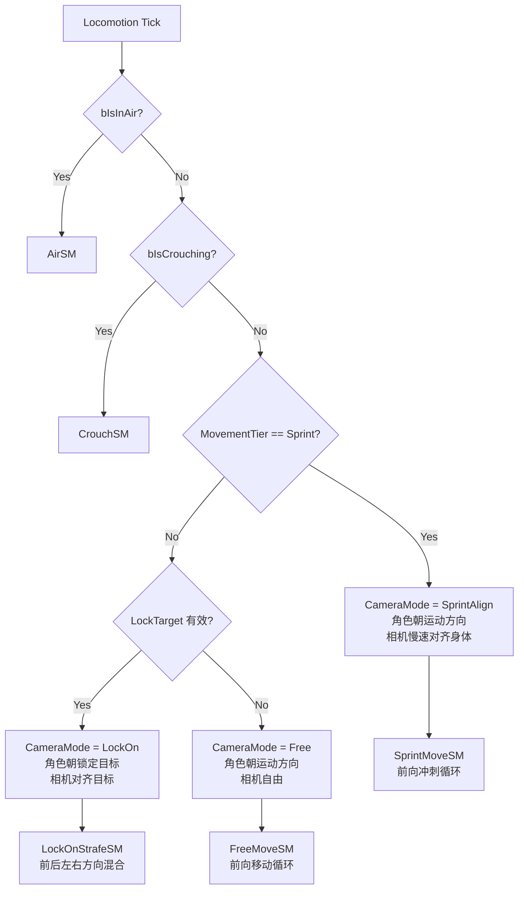
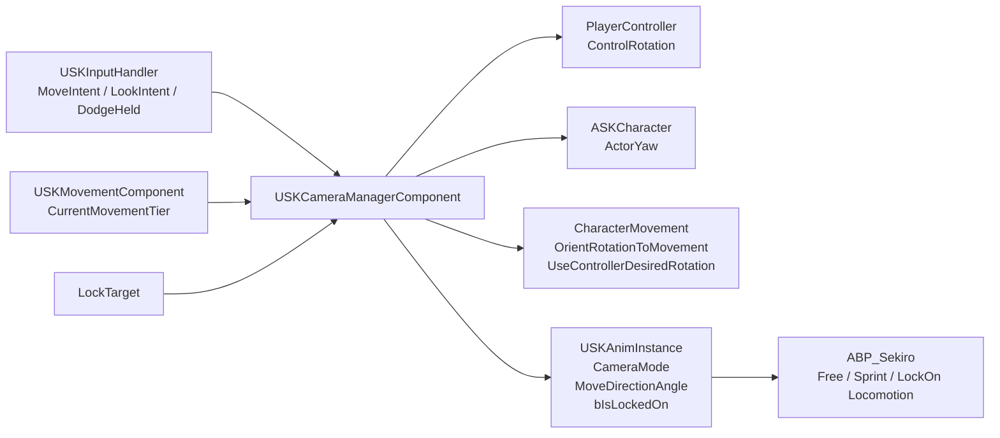
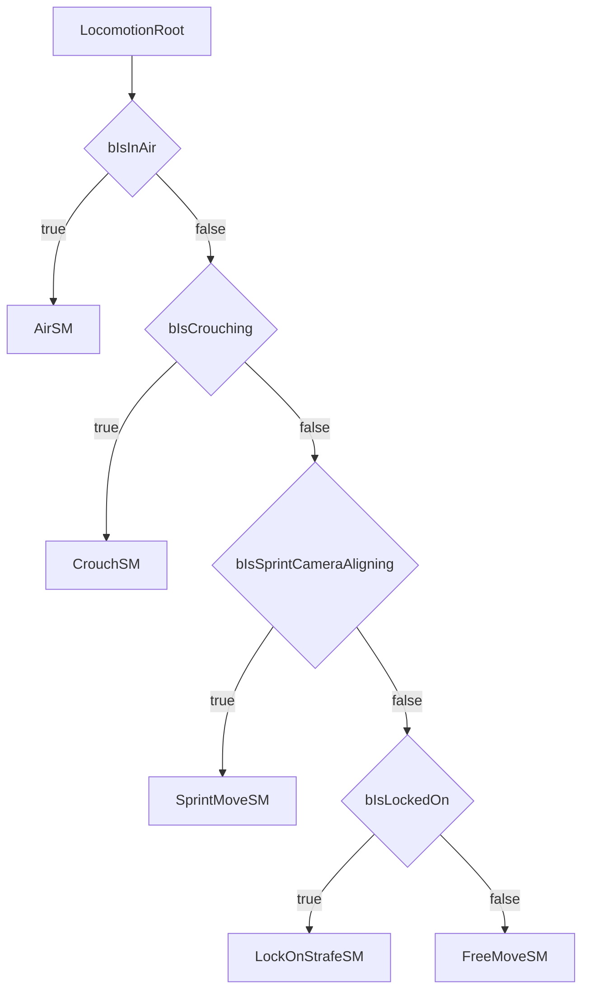
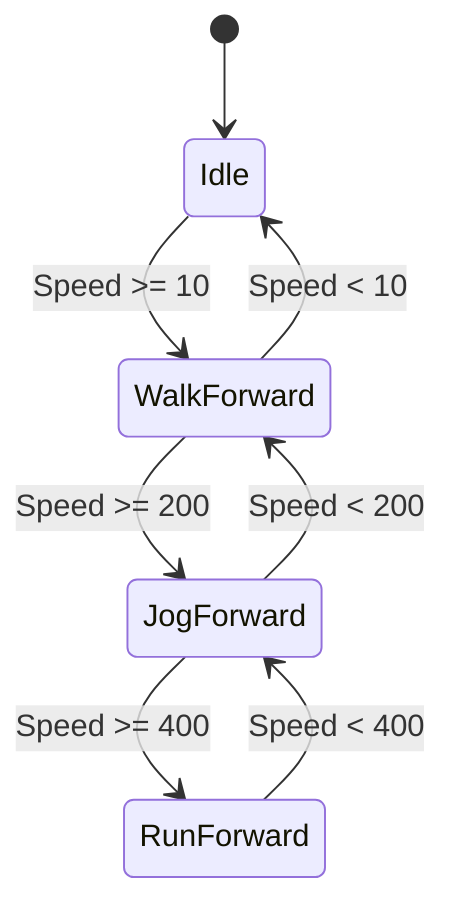
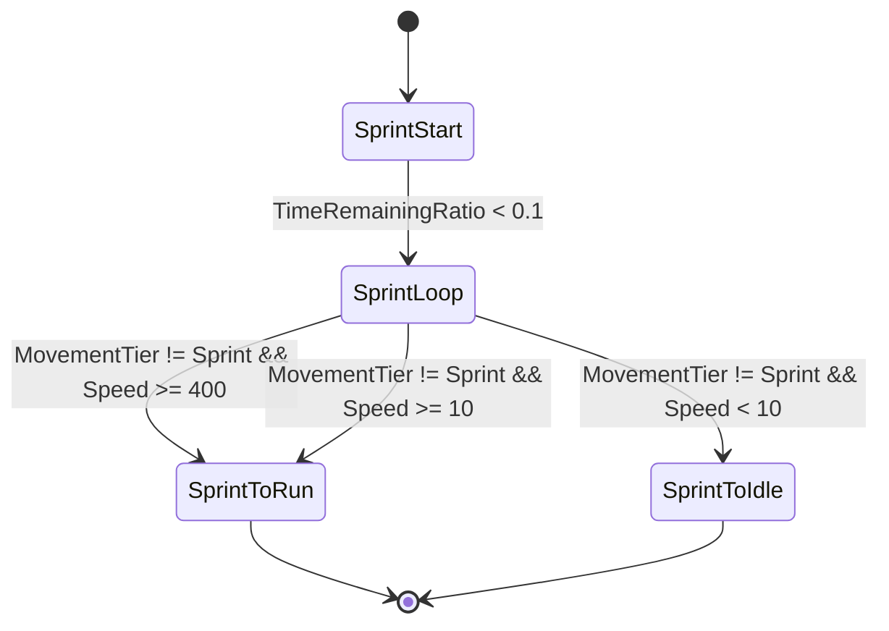
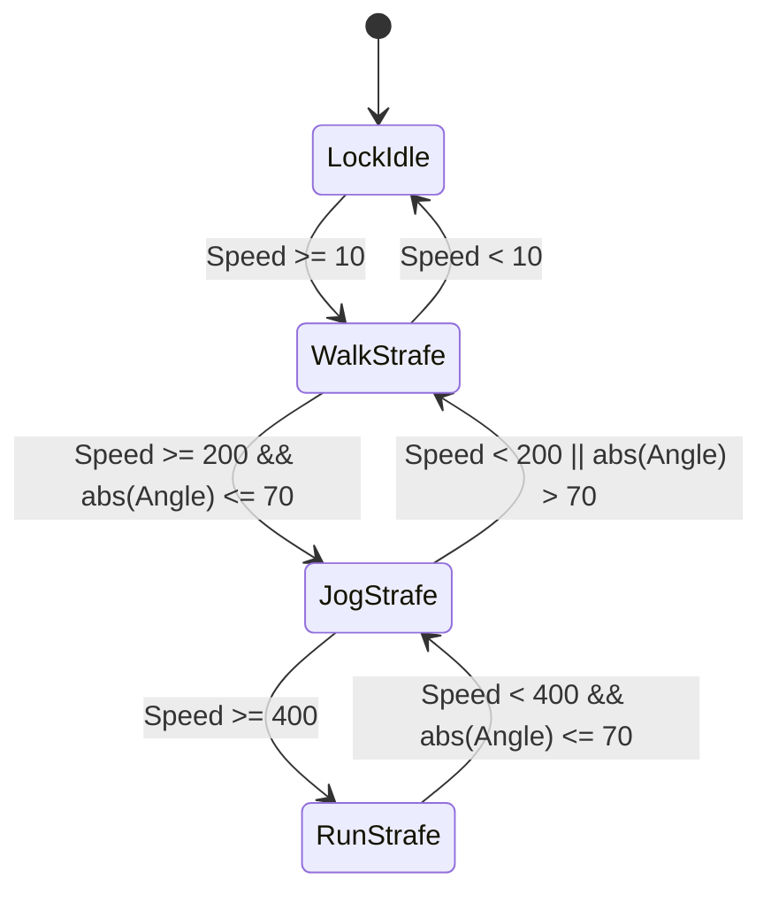

# Sekiro 角色摄像头与 Locomotion 方案

> 创建日期：2026-07-02
> 关联文档：[AnimBlueprint 方案](sekiro-anim-blueprint.md)
> 锁定动画详细设计：[Sekiro 锁定状态 Locomotion 设计](sekiro-lockon-locomotion.md)
>
> 目标：还原只狼原版“非锁定自由移动 / 锁定环绕移动 / 冲刺强制前向”的角色朝向、摄像机和动画蓝图协作规则。

## 零、资源事实修正

`animation_annotation.md` 当前未同步最新人工核对结果，Locomotion 设计以实际导入动画为准：

- 地面移动动画只按 **Walk / Run / Sprint** 三种步态组织。
- 原版 Walk 输入来自手柄摇杆轻推，键盘为 `Alt + WASD`。
- 原版 Run 是默认移动，键盘 `WASD` / 手柄正常推杆进入 Run。
- 原版 Sprint 来自手柄 `B` 或键盘 `Shift`，项目现有输入里仍由 Dodge/冲刺按住逻辑触发。
- 当前不存在 `Jog` 独立动画蓝图步态，也不再保留 `ESKMovementTier::Jog`。
- 不再假设存在斜向循环动画；锁定斜向表现后续应通过主方向动画 + 方向校正/Orientation Warping/转向过渡解决。

## 一、核心规则

| 模式 | 触发条件 | 角色朝向 | 摄像机 | 动画策略 |
|------|----------|----------|--------|----------|
| Free | 未锁定，非冲刺 | 朝运动方向 | 不强制跟随身体朝向 | FreeMoveSM，主要前向循环 |
| SprintAlign | 冲刺中，无论是否锁定 | 朝运动方向 | 慢慢过渡到身体朝向 | SprintForward，使用冲刺前向循环 |
| LockOn | 锁定且非冲刺 | 朝锁定目标 | 过渡到锁定目标 | LockOnStrafeSM，前后左右方向混合 |

优先级固定为：

```text
SprintAlign > LockOn > Free
```

因此锁定中按住冲刺时，角色临时脱离 LockOnStrafe，身体转向运动方向并播放前向冲刺循环；停止冲刺后，角色和摄像机再插值回锁定目标。

### 1.1 模式决策图



### 1.2 运行时数据流



## 二、摄像头管理类

推荐新增 `USKCameraManagerComponent`，挂载到 `ASKCharacter`。它不替换 UE 的 `APlayerCameraManager`，只管理本项目角色的：

- 控制器 ControlRotation
- 角色 ActorYaw
- `CharacterMovement` 朝向开关
- 锁定目标
- 摄像机模式状态
- 给 ABP 读取的 `bIsLockedOn` / `bIsSprintCameraAligning`

### 2.1 头文件草案

目标路径：`Source/Sekiro/Camera/SKCameraManagerComponent.h`

```cpp
#pragma once

#include "CoreMinimal.h"
#include "Components/ActorComponent.h"
#include "SKCameraManagerComponent.generated.h"

class ACharacter;
class APlayerController;
class USKInputHandler;
class USKMovementComponent;
class UCharacterMovementComponent;

UENUM(BlueprintType)
enum class ESKCameraMode : uint8
{
    Free,           // 自由视角
    SprintAlign,    // 冲刺对齐
    LockOn          // 锁定视角
};

UCLASS(ClassGroup=(Camera), meta=(BlueprintSpawnableComponent))
class SEKIRO_API USKCameraManagerComponent : public UActorComponent
{
    GENERATED_BODY()

public:
    USKCameraManagerComponent();

    // ── 锁定接口 ──────────────────────────────────────────────

    UFUNCTION(BlueprintCallable, Category = "Camera|LockOn")
    void SetLockTarget(AActor* NewTarget);                 // 设置锁定目标

    UFUNCTION(BlueprintCallable, Category = "Camera|LockOn")
    void ClearLockTarget();                                // 清除锁定目标

    UFUNCTION(BlueprintCallable, Category = "Camera|LockOn")
    void ToggleLockTarget(AActor* NewTarget);              // 切换锁定目标

    UFUNCTION(BlueprintCallable, Category = "Camera|LockOn")
    bool IsLockedOn() const;                               // 是否处于锁定模式

    UFUNCTION(BlueprintCallable, Category = "Camera|LockOn")
    AActor* GetLockTarget() const;                         // 获取锁定目标

    // ── 输入接口 ──────────────────────────────────────────────

    UFUNCTION(BlueprintCallable, Category = "Camera|Input")
    void AddLookInput(FVector2D LookAxis);                 // 摄像机输入

    // ── 动画接口 ──────────────────────────────────────────────

    UFUNCTION(BlueprintCallable, Category = "Camera|Animation")
    ESKCameraMode GetCameraMode() const;                   // 当前摄像机模式

    UFUNCTION(BlueprintCallable, Category = "Camera|Animation")
    bool IsSprintCameraAligning() const;                   // 是否冲刺相机对齐中

    UFUNCTION(BlueprintCallable, Category = "Camera|Animation")
    float GetMoveDirectionAngle() const;                   // 移动相对角色朝向角度

protected:
    virtual void BeginPlay() override;
    virtual void TickComponent(float DeltaTime, ELevelTick TickType, FActorComponentTickFunction* ThisTickFunction) override;

    // ── 配置 ──────────────────────────────────────────────────

    UPROPERTY(EditAnywhere, BlueprintReadWrite, Category = "Camera|Sensitivity")
    float LookSensitivityYaw = 1.0f;                       // 水平灵敏度

    UPROPERTY(EditAnywhere, BlueprintReadWrite, Category = "Camera|Sensitivity")
    float LookSensitivityPitch = 1.0f;                     // 俯仰灵敏度

    UPROPERTY(EditAnywhere, BlueprintReadWrite, Category = "Camera|Sensitivity")
    uint32 bInvertPitch : 1;                               // 俯仰反转

    UPROPERTY(EditAnywhere, BlueprintReadWrite, Category = "Camera|Free")
    float FreeTurnInterpSpeed = 10.f;                      // 自由移动身体转向速度

    UPROPERTY(EditAnywhere, BlueprintReadWrite, Category = "Camera|Sprint")
    float SprintBodyTurnInterpSpeed = 14.f;                // 冲刺身体转向速度

    UPROPERTY(EditAnywhere, BlueprintReadWrite, Category = "Camera|Sprint")
    float SprintCameraAlignSpeed = 3.f;                    // 冲刺相机对齐速度

    UPROPERTY(EditAnywhere, BlueprintReadWrite, Category = "Camera|LockOn")
    float LockOnBodyTurnInterpSpeed = 16.f;                // 锁定身体转向速度

    UPROPERTY(EditAnywhere, BlueprintReadWrite, Category = "Camera|LockOn")
    float LockOnCameraAlignSpeed = 8.f;                    // 锁定相机对齐速度

    UPROPERTY(EditAnywhere, BlueprintReadWrite, Category = "Camera|Pitch")
    float MinPitch = -60.f;                                // 最小俯仰

    UPROPERTY(EditAnywhere, BlueprintReadWrite, Category = "Camera|Pitch")
    float MaxPitch = 45.f;                                 // 最大俯仰

private:
    // ── 内部流程 ──────────────────────────────────────────────

    void CacheOwnerRefs();                                 // 缓存所有者引用
    void UpdateCameraMode();                               // 更新模式
    void UpdateMovementRotationPolicy();                   // 更新移动组件朝向策略
    void UpdateFree(float DeltaTime);                      // 自由视角更新
    void UpdateSprintAlign(float DeltaTime);               // 冲刺对齐更新
    void UpdateLockOn(float DeltaTime);                    // 锁定视角更新
    void SetControlYaw(float TargetYaw, float InterpSpeed, float DeltaTime); // 设置控制器 Yaw
    void SetActorYaw(float TargetYaw, float InterpSpeed, float DeltaTime);   // 设置角色 Yaw
    bool IsSprinting() const;                              // 是否冲刺
    bool HasMoveInput() const;                             // 是否有移动输入
    FRotator GetMoveWorldRotation() const;                 // 获取移动世界方向
    FRotator GetLockTargetRotation() const;                // 获取锁定目标方向

    // ── 缓存 ──────────────────────────────────────────────────

    UPROPERTY()
    TObjectPtr<ACharacter> OwnerCharacter;                 // 所有者角色

    UPROPERTY()
    TObjectPtr<APlayerController> OwnerController;         // 玩家控制器

    UPROPERTY()
    TObjectPtr<USKInputHandler> InputHandler;              // 输入组件

    UPROPERTY()
    TObjectPtr<USKMovementComponent> MovementComponent;    // 只狼移动组件

    UPROPERTY()
    TObjectPtr<AActor> LockTarget;                         // 锁定目标

    ESKCameraMode CameraMode = ESKCameraMode::Free;        // 当前摄像机模式
    FVector2D LastLookInput = FVector2D::ZeroVector;       // 最近视角输入
};
```

### 2.2 源文件草案

目标路径：`Source/Sekiro/Camera/SKCameraManagerComponent.cpp`

```cpp
#include "Camera/SKCameraManagerComponent.h"
#include "Input/SKInputHandler.h"
#include "Movement/SKMovementComponent.h"
#include "GameFramework/Character.h"
#include "GameFramework/CharacterMovementComponent.h"
#include "GameFramework/PlayerController.h"
#include "Kismet/KismetMathLibrary.h"

USKCameraManagerComponent::USKCameraManagerComponent()
{
    PrimaryComponentTick.bCanEverTick = true;
    PrimaryComponentTick.TickGroup = TG_PrePhysics;
    bInvertPitch = false;
}

void USKCameraManagerComponent::SetLockTarget(AActor* NewTarget)
{
    LockTarget = NewTarget;
    UpdateCameraMode();
}

void USKCameraManagerComponent::ClearLockTarget()
{
    LockTarget = nullptr;
    UpdateCameraMode();
}

void USKCameraManagerComponent::ToggleLockTarget(AActor* NewTarget)
{
    if (LockTarget && LockTarget == NewTarget)
    {
        ClearLockTarget();
        return;
    }

    SetLockTarget(NewTarget);
}

bool USKCameraManagerComponent::IsLockedOn() const
{
    return LockTarget != nullptr && CameraMode == ESKCameraMode::LockOn;
}

AActor* USKCameraManagerComponent::GetLockTarget() const
{
    return LockTarget;
}

void USKCameraManagerComponent::AddLookInput(FVector2D LookAxis)
{
    if (!OwnerCharacter || !OwnerController) return;

    LastLookInput = LookAxis;

    if (CameraMode != ESKCameraMode::Free) return;

    LookAxis.X *= LookSensitivityYaw;
    LookAxis.Y *= LookSensitivityPitch;

    if (bInvertPitch)
    {
        LookAxis.Y *= -1.f;
    }

    OwnerCharacter->AddControllerYawInput(LookAxis.X);
    OwnerCharacter->AddControllerPitchInput(LookAxis.Y);

    FRotator ControlRotation = OwnerController->GetControlRotation();
    ControlRotation.Pitch = FMath::ClampAngle(ControlRotation.Pitch, MinPitch, MaxPitch);
    OwnerController->SetControlRotation(ControlRotation);
}

ESKCameraMode USKCameraManagerComponent::GetCameraMode() const
{
    return CameraMode;
}

bool USKCameraManagerComponent::IsSprintCameraAligning() const
{
    return CameraMode == ESKCameraMode::SprintAlign;
}

float USKCameraManagerComponent::GetMoveDirectionAngle() const
{
    if (!OwnerCharacter) return 0.f;

    const FVector Velocity = OwnerCharacter->GetVelocity();
    if (Velocity.SizeSquared2D() < KINDA_SMALL_NUMBER) return 0.f;

    const FVector Forward = OwnerCharacter->GetActorForwardVector().GetSafeNormal2D();
    const FVector MoveDirection = Velocity.GetSafeNormal2D();
    const float Dot = FVector::DotProduct(Forward, MoveDirection);
    const float CrossZ = FVector::CrossProduct(Forward, MoveDirection).Z;
    return FMath::RadiansToDegrees(FMath::Atan2(CrossZ, Dot));
}

void USKCameraManagerComponent::BeginPlay()
{
    Super::BeginPlay();
    CacheOwnerRefs();
    UpdateMovementRotationPolicy();
}

void USKCameraManagerComponent::TickComponent(float DeltaTime, ELevelTick TickType, FActorComponentTickFunction* ThisTickFunction)
{
    Super::TickComponent(DeltaTime, TickType, ThisTickFunction);

    if (!OwnerCharacter || !OwnerController)
    {
        CacheOwnerRefs();
        if (!OwnerCharacter || !OwnerController) return;
    }

    UpdateCameraMode();
    UpdateMovementRotationPolicy();

    if (CameraMode == ESKCameraMode::SprintAlign)
    {
        UpdateSprintAlign(DeltaTime);
    }
    else if (CameraMode == ESKCameraMode::LockOn)
    {
        UpdateLockOn(DeltaTime);
    }
    else
    {
        UpdateFree(DeltaTime);
    }
}

void USKCameraManagerComponent::CacheOwnerRefs()
{
    OwnerCharacter = Cast<ACharacter>(GetOwner());
    if (!OwnerCharacter) return;

    OwnerController = Cast<APlayerController>(OwnerCharacter->GetController());
    InputHandler = OwnerCharacter->FindComponentByClass<USKInputHandler>();
    MovementComponent = Cast<USKMovementComponent>(OwnerCharacter->GetCharacterMovement());
}

void USKCameraManagerComponent::UpdateCameraMode()
{
    if (IsSprinting())
    {
        CameraMode = ESKCameraMode::SprintAlign;
        return;
    }

    CameraMode = LockTarget ? ESKCameraMode::LockOn : ESKCameraMode::Free;
}

void USKCameraManagerComponent::UpdateMovementRotationPolicy()
{
    if (!OwnerCharacter) return;

    UCharacterMovementComponent* MoveComp = OwnerCharacter->GetCharacterMovement();
    if (!MoveComp) return;

    const bool bUseFreeRotation = CameraMode == ESKCameraMode::Free;
    MoveComp->bOrientRotationToMovement = bUseFreeRotation;
    MoveComp->bUseControllerDesiredRotation = !bUseFreeRotation;
    OwnerCharacter->bUseControllerRotationYaw = false;
}

void USKCameraManagerComponent::UpdateFree(float DeltaTime)
{
    if (!HasMoveInput()) return;

    const FRotator MoveRotation = GetMoveWorldRotation();
    SetActorYaw(MoveRotation.Yaw, FreeTurnInterpSpeed, DeltaTime);
}

void USKCameraManagerComponent::UpdateSprintAlign(float DeltaTime)
{
    if (!HasMoveInput()) return;

    const FRotator MoveRotation = GetMoveWorldRotation();
    SetActorYaw(MoveRotation.Yaw, SprintBodyTurnInterpSpeed, DeltaTime);
    SetControlYaw(MoveRotation.Yaw, SprintCameraAlignSpeed, DeltaTime);
}

void USKCameraManagerComponent::UpdateLockOn(float DeltaTime)
{
    if (!LockTarget)
    {
        UpdateCameraMode();
        return;
    }

    const FRotator LockRotation = GetLockTargetRotation();
    SetActorYaw(LockRotation.Yaw, LockOnBodyTurnInterpSpeed, DeltaTime);
    SetControlYaw(LockRotation.Yaw, LockOnCameraAlignSpeed, DeltaTime);
}

void USKCameraManagerComponent::SetControlYaw(float TargetYaw, float InterpSpeed, float DeltaTime)
{
    if (!OwnerController) return;

    FRotator Current = OwnerController->GetControlRotation();
    FRotator Target = Current;
    Target.Yaw = TargetYaw;
    Current = FMath::RInterpTo(Current, Target, DeltaTime, InterpSpeed);
    Current.Pitch = FMath::ClampAngle(Current.Pitch, MinPitch, MaxPitch);
    OwnerController->SetControlRotation(Current);
}

void USKCameraManagerComponent::SetActorYaw(float TargetYaw, float InterpSpeed, float DeltaTime)
{
    if (!OwnerCharacter) return;

    FRotator Current = OwnerCharacter->GetActorRotation();
    FRotator Target = Current;
    Target.Yaw = TargetYaw;
    OwnerCharacter->SetActorRotation(FMath::RInterpTo(Current, Target, DeltaTime, InterpSpeed));
}

bool USKCameraManagerComponent::IsSprinting() const
{
    return MovementComponent && MovementComponent->CurrentMovementTier == ESKMovementTier::Sprint;
}

bool USKCameraManagerComponent::HasMoveInput() const
{
    return InputHandler && InputHandler->GetMoveIntent().SizeSquared() > 0.01f;
}

FRotator USKCameraManagerComponent::GetMoveWorldRotation() const
{
    if (!OwnerController || !InputHandler) return FRotator::ZeroRotator;

    const FVector2D MoveIntent = InputHandler->GetMoveIntent();
    const FRotator ControlYaw(0.f, OwnerController->GetControlRotation().Yaw, 0.f);
    const FVector Forward = FRotationMatrix(ControlYaw).GetUnitAxis(EAxis::X);
    const FVector Right = FRotationMatrix(ControlYaw).GetUnitAxis(EAxis::Y);
    const FVector MoveWorld = (Forward * MoveIntent.Y + Right * MoveIntent.X).GetSafeNormal2D();

    return MoveWorld.IsNearlyZero() ? OwnerCharacter->GetActorRotation() : MoveWorld.Rotation();
}

FRotator USKCameraManagerComponent::GetLockTargetRotation() const
{
    if (!OwnerCharacter || !LockTarget) return FRotator::ZeroRotator;

    const FVector From = OwnerCharacter->GetActorLocation();
    const FVector To = LockTarget->GetActorLocation();
    FRotator Rotation = UKismetMathLibrary::FindLookAtRotation(From, To);
    Rotation.Pitch = 0.f;
    Rotation.Roll = 0.f;
    return Rotation;
}
```

### 2.3 集成点

`ASKCharacter`：

- 新增 `TObjectPtr<USKCameraManagerComponent> CameraManagerComponent`
- 构造函数 `CreateDefaultSubobject<USKCameraManagerComponent>(TEXT("CameraManagerComponent"))`
- 增加 `GetCameraManagerComponent()`
- 保留 `CameraBoom->bUsePawnControlRotation = true`

`USKInputHandler::OnLook`：

- 优先查找 `USKCameraManagerComponent`
- 调用 `CameraManager->AddLookInput(LookAxis)`
- 不再直接 `Owner->AddControllerYawInput/PitchInput`

锁定输入：

- `OnLockOnStarted` 只设置 `bLockOnPressed`
- 锁定目标搜索可由蓝图或后续 LockOnComponent 完成，然后调用 `SetLockTarget(Target)`

`USKAnimInstance`：

- 新增 BlueprintReadOnly：
  - `bIsLockedOn`
  - `bIsSprintCameraAligning`
  - `CameraMode`
  - `MoveDirectionAngle`
- 每帧从 `USKCameraManagerComponent` 读取

## 三、动画蓝图配置方案

### 3.1 AnimGraph 总结构

```text
LocomotionRoot
└── Blend Poses by Enum: CameraMode
    ├── Free          → FreeMoveSM
    ├── SprintAlign   → SprintMoveSM
    └── LockOn        → LockOnStrafeSM
```

注意：如果 UE 蓝图里 `Blend Poses by Enum` 操作成本太高，也可改成两个 `Blend Poses by Bool`：

```text
if bIsSprintCameraAligning:
    SprintMoveSM
else if bIsLockedOn:
    LockOnStrafeSM
else:
    FreeMoveSM
```

图形结构：



### 3.2 FreeMoveSM

非锁定、非冲刺时使用。角色朝运动方向，动画主要播放前向循环。

```text
FreeMoveSM
├── Idle
├── WalkForward
├── JogForward
└── RunForward
```



Transition Rule：

| 过渡 | 条件 |
|------|------|
| Idle → WalkForward | Speed >= 10 |
| WalkForward → Idle | Speed < 10 |
| WalkForward → JogForward | Speed >= 200 |
| JogForward → WalkForward | Speed < 200 |
| JogForward → RunForward | Speed >= 400 |
| RunForward → JogForward | Speed < 400 |
| Any → SprintMoveSM | CameraMode == SprintAlign |
| Any → LockOnStrafeSM | CameraMode == LockOn |

动画绑定：

| 状态 | 动画 |
|------|------|
| Idle | `Anim_Sekiro_a000_000000` |
| WalkForward | `Anim_Sekiro_a000_000200` |
| JogForward | `Anim_Sekiro_a000_000400` |
| RunForward | `Anim_Sekiro_a000_000500` |

`MoveDirectionAngle` 在 FreeMoveSM 中只用于急转判断，不用于常规循环混合。

### 3.3 SprintMoveSM

冲刺是覆盖状态，无论锁定还是非锁定都强制前向。

```text
SprintMoveSM
├── SprintStart
├── SprintLoop
└── SprintStopOrToRun
```



动画绑定：

| 状态 | 动画 |
|------|------|
| SprintStart | `Anim_Sekiro_a000_001151` 起跑前向，侧向起跑可按输入使用 `001152/001153/001154` |
| SprintLoop | `Anim_Sekiro_a000_001200` |
| SprintStop | `Anim_Sekiro_a000_001402` / `001403` |
| SprintToIdle | `Anim_Sekiro_a000_001510` |
| SprintTransition | `Anim_Sekiro_a000_001511`（具体语义待核对） |
| SprintToRun | `Anim_Sekiro_a000_001512` |

Transition Rule：

| 过渡 | 条件 |
|------|------|
| SprintStart → SprintLoop | TimeRemainingRatio < 0.1 |
| SprintLoop → SprintToRun | MovementTier != Sprint && Speed >= 400 |
| SprintLoop → SprintToRun | MovementTier != Sprint && Speed >= 10 |
| SprintLoop → SprintToIdle | MovementTier != Sprint && Speed < 10 |
| SprintLoop → SprintStop | MovementTier != Sprint && Speed < 200 |
| SprintMoveSM → LockOnStrafeSM | CameraMode == LockOn |
| SprintMoveSM → FreeMoveSM | CameraMode == Free |

### 3.4 LockOnStrafeSM

锁定且非冲刺时使用。角色朝锁定目标，动画按移动相对角色前方的角度混合。

```text
LockOnStrafeSM
├── LockIdle
├── WalkStrafe
├── JogStrafe
└── RunStrafe
```



BlendSpace：

| 资产 | 轴 | 样本 |
|------|----|------|
| `BS_Walk_Direction` | Direction -180~180 | 0=200, 180=201, -90=202, 90=203 |
| `BS_Jog_Direction` | Direction -90~90 | 0=400, -45=401, 45=402 |
| `BS_Run_Direction` | Direction -180~180 | 0=500, 180=501, -90=502, 90=503 |

锁定模式不再配置 Jog 分支；侧后方向由 WalkStrafe / RunStrafe 和方向校正处理。

Transition Rule：

| 过渡 | 条件 |
|------|------|
| LockIdle → WalkStrafe | Speed >= 10 |
| WalkStrafe → LockIdle | Speed < 10 |
| WalkStrafe → JogStrafe | Speed >= 200 && abs(MoveDirectionAngle) <= 70 |
| JogStrafe → WalkStrafe | Speed < 200 或 abs(MoveDirectionAngle) > 70 |
| JogStrafe → RunStrafe | Speed >= 400 |
| RunStrafe → JogStrafe | Speed < 400 && abs(MoveDirectionAngle) <= 70 |
| Any → SprintMoveSM | CameraMode == SprintAlign |
| Any → FreeMoveSM | CameraMode == Free |

### 3.5 ABP 暴露变量

| 变量 | 类型 | 来源 | 用途 |
|------|------|------|------|
| `Speed` | float | `USKAnimInstance` | 移动层级 |
| `MoveDirectionAngle` | float | `USKCameraManagerComponent` | 锁定方向混合 |
| `CameraMode` | `ESKCameraMode` | `USKCameraManagerComponent` | 选择 Free/Sprint/LockOn |
| `bIsLockedOn` | bool | `USKCameraManagerComponent` | 锁定分支 |
| `bIsSprintCameraAligning` | bool | `USKCameraManagerComponent` | Sprint 覆盖 |
| `MovementTier` | `ESKMovementTier` | `USKMovementComponent` | Sprint 判断 |
| `bIsInAir` | bool | CharacterMovement | AirSM 覆盖 |
| `bIsCrouching` | bool | Character | CrouchSM 覆盖 |

### 3.6 最终优先级

Locomotion 入口建议按以下顺序判定：

```text
if bIsInAir:
    AirSM
else if bIsCrouching:
    CrouchSM
else if CameraMode == SprintAlign:
    SprintMoveSM
else if CameraMode == LockOn:
    LockOnStrafeSM
else:
    FreeMoveSM
```

这样可以保证：

- 冲刺永远是前向循环
- 锁定非冲刺才使用前后左右移动
- 非锁定摄像机不被身体朝向影响
- 非锁定冲刺时摄像机慢慢对齐身体
- 锁定时摄像机和身体都回到目标方向

## 四、编辑器配置步骤

### 4.1 角色蓝图配置

| 步骤 | 位置 | 配置 | 说明 |
|------|------|------|------|
| 1 | `BP_SekiroCharacter` 组件面板 | 确认存在 `CameraBoom` / `FollowCamera` / `CameraManagerComponent` | C++ 集成后组件自动出现 |
| 2 | `CameraBoom` | `Use Pawn Control Rotation = true` | 摄像机读取 PlayerController ControlRotation |
| 3 | `FollowCamera` | `Use Pawn Control Rotation = false` | 相机本身不重复继承控制旋转 |
| 4 | `CharacterMovement` | 默认 `Orient Rotation to Movement = true` | 运行时由 CameraManager 按模式覆盖 |
| 5 | `Character` | `Use Controller Rotation Yaw = false` | 角色 Yaw 由组件插值控制 |
| 6 | `CameraManagerComponent` | 调整 Free/Sprint/LockOn 插值速度 | Sprint 相机慢，LockOn 相机快 |

建议初始参数：

| 参数 | 推荐值 | 效果 |
|------|--------|------|
| `FreeTurnInterpSpeed` | 10 | 非锁定身体跟随移动方向 |
| `SprintBodyTurnInterpSpeed` | 14 | 冲刺身体快速对齐运动方向 |
| `SprintCameraAlignSpeed` | 3 | 冲刺相机慢慢拉到身体后方 |
| `LockOnBodyTurnInterpSpeed` | 16 | 锁定身体快速朝目标 |
| `LockOnCameraAlignSpeed` | 8 | 锁定相机对齐目标 |
| `MinPitch` | -60 | 相机最低俯角 |
| `MaxPitch` | 45 | 相机最高仰角 |

### 4.2 锁定目标配置

| 步骤 | 位置 | 操作 |
|------|------|------|
| 1 | 玩家蓝图或后续 `LockOnComponent` | 输入 LockOn 时搜索候选敌人 |
| 2 | 搜索逻辑 | 过滤距离、屏幕中心夹角、可见性 |
| 3 | 找到目标 | 调用 `CameraManagerComponent.SetLockTarget(Target)` |
| 4 | 取消锁定 | 调用 `CameraManagerComponent.ClearLockTarget()` |
| 5 | 切换目标 | 调用 `CameraManagerComponent.SetLockTarget(NextTarget)` |

锁定目标搜索可暂时放在蓝图里，后续再独立成 `USKLockOnComponent`。

### 4.3 ABP 变量绑定

| ABP 变量 | 类型 | 读取来源 | 用法 |
|----------|------|----------|------|
| `CameraMode` | `ESKCameraMode` | `USKAnimInstance` | 选择 Free/Sprint/LockOn 分支 |
| `bIsLockedOn` | bool | `USKAnimInstance` | LockOnStrafeSM 条件 |
| `bIsSprintCameraAligning` | bool | `USKAnimInstance` | SprintMoveSM 优先条件 |
| `MoveDirectionAngle` | float | `USKAnimInstance` | Direction BlendSpace X 轴 |
| `Speed` | float | `USKAnimInstance` | 状态切换 |
| `MovementTier` | `ESKMovementTier` | `USKAnimInstance` | Sprint 退出判断 |

### 4.4 BlendSpace 资产配置

| 资产 | Skeleton | Axis | 样本点 |
|------|----------|------|--------|
| `BS_Walk_Direction` | `Sekiro_Skeleton` | Direction `-180~180` | `0=000200`、`180=000201`、`-90=000202`、`90=000203` |
| `BS_Run_Direction` | `Sekiro_Skeleton` | Direction `-180~180` | `0=000500`、`180=000501`、`-90=000502`、`90=000503` |
| `BS_Jog_Direction` | `Sekiro_Skeleton` | Direction `-90~90` | `0=000400`、`-45=000401`、`45=000402` |

Sprint 不做方向 BlendSpace，直接用：

| 用途 | 动画 |
|------|------|
| 起跑 | `Anim_Sekiro_a000_001151`，必要时用 `001152/001153/001154` |
| 循环 | `Anim_Sekiro_a000_001200` |
| 停止 | `Anim_Sekiro_a000_001402` / `001403` |
| 降级 | `001510` / `001511` / `001512` |

### 4.5 验证矩阵

| 场景 | 操作 | 预期 |
|------|------|------|
| 非锁定走/跑 | WASD 移动 | 角色朝运动方向，相机不被身体拖动 |
| 非锁定冲刺 | 按住 Dodge + 移动 | 角色朝运动方向，播放 SprintLoop，相机慢慢对齐身体 |
| 锁定走/跑 | 锁定目标后 WASD | 角色朝目标，前后左右 Strafe 混合 |
| 锁定冲刺 | 锁定后按住 Dodge + 移动 | 临时进入 SprintForward，角色朝运动方向 |
| 冲刺结束仍锁定 | 松开 Dodge | 回到 LockOn，角色和相机重新对齐目标 |
| 锁定取消 | ClearLockTarget | 回到 FreeMove，相机恢复自由控制 |
