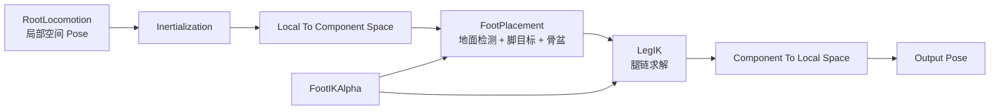
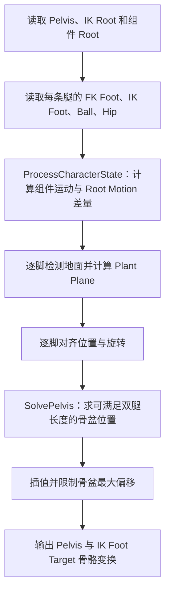
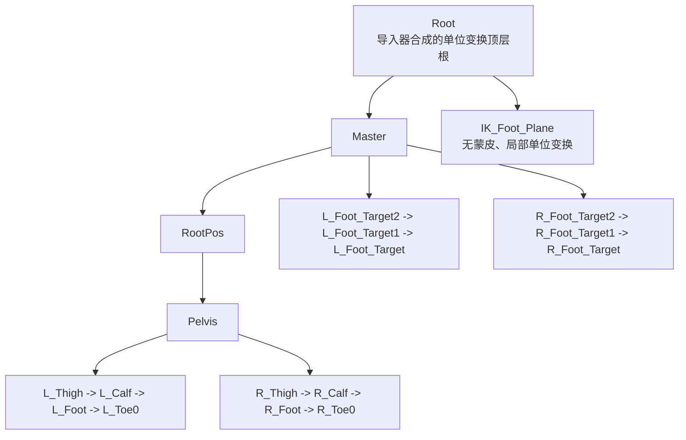
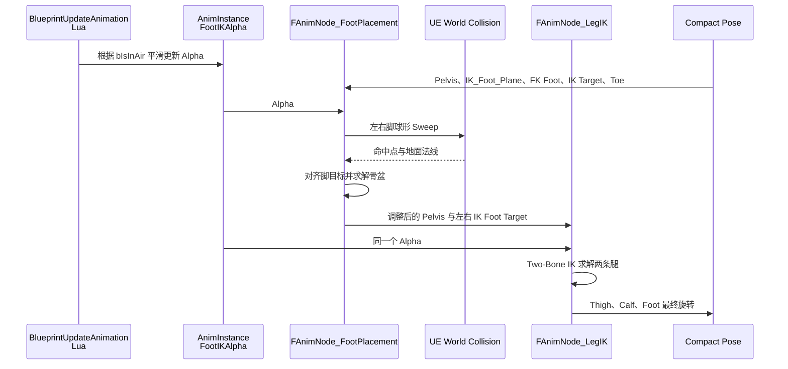

# Sekiro 双脚 Foot IK 实现详解

> 本文记录当前项目中已经落地的 Foot IK 实现，而不是通用 UE 教程。内容覆盖 Lua 动画图声明、Lua 运行时权重、Lua IR 到原生 AnimNode 的生成链路、UE 5.2 `FootPlacement`/`LegIK` 源码逻辑，以及专用参考骨骼 `IK_Foot_Plane` 的设计原因。

## 1. 结论与职责边界

当前所谓的“双脚 Foot IK”不是一个节点，而是两个 UE 原生 Skeletal Control 节点串联：

- `FAnimNode_FootPlacement`：读取输入姿势，检测地面，计算两只脚的目标位置与旋转，并求解骨盆补偿。
- `FAnimNode_LegIK`：把 `FootPlacement` 得到的左右脚目标真正落实到 `Thigh -> Calf -> Foot` 变形骨骼链。

Lua 不执行射线检测，也不直接修改 `FCompactPose`。Lua 的职责是：

1. 声明 AnimGraph 中有哪些原生节点以及连接顺序。
2. 配置骨骼名、检测范围、骨盆限制、求解精度等参数。
3. 每帧根据 `bIsInAir` 计算两个原生节点共用的 `FootIKAlpha`。

插件 C++ 的职责是把 Lua 编译出的 IR 校验并转换成原生 AnimBlueprint 节点。最终姿势计算仍由 UE 原生动画线程代码完成。


## 2. 最终 AnimGraph 链路

项目主动画图位于 [`ABP_Sekiro.lua`](../Content/Script/Animation/Sekiro/ABP_Sekiro.lua)。Foot IK 被放在整个 Locomotion 状态机和惯性化之后：



之所以要先转到组件空间，是因为脚、骨盆和地面之间的几何关系需要在统一坐标系中计算。状态机通常输出局部骨骼姿势，而 `FootPlacement` 与 `LegIK` 都是 Component Space Skeletal Control。

对应 Lua 结构如下：

```lua
function ABP_Sekiro:AnimGraph(Graph)
    local foot_ik = Tuning.FootIK
    local locomotion = Graph:StateMachine("RootLocomotion", RootLocomotion)
    local inertialization = Graph:Inertialization("LocomotionInertialization")
    inertialization.Source:Connect(locomotion.Pose)

    local to_component = Graph:LocalToComponentSpace("FootIKLocalToComponent")
    to_component.LocalPose:Connect(inertialization.Pose)

    local foot_placement = Graph:FootPlacement("FootPlacement")
    foot_placement.IKFootRootBone = foot_ik.IKFootRootBone
    foot_placement.PelvisBone = foot_ik.PelvisBone
    foot_placement.LegDefinitions = foot_ik.FootPlacementLegDefinitions
    foot_placement.PlantSpeedMode = foot_ik.PlantSpeedMode
    foot_placement.PlantLockType = foot_ik.PlantLockType
    foot_placement.PelvisMaxOffset = foot_ik.PelvisMaxOffset
    foot_placement.PelvisHorizontalRebalancingWeight =
        foot_ik.PelvisHorizontalRebalancingWeight
    foot_placement.PlantSpeedThreshold = foot_ik.PlantSpeedThreshold
    foot_placement.PlantDistanceToGround = foot_ik.PlantDistanceToGround
    foot_placement.TraceStartOffset = foot_ik.TraceStartOffset
    foot_placement.TraceEndOffset = foot_ik.TraceEndOffset
    foot_placement.TraceSweepRadius = foot_ik.TraceSweepRadius
    foot_placement.TraceMaxGroundPenetration = foot_ik.TraceMaxGroundPenetration
    foot_placement.bTraceEnabled = true
    foot_placement.ComponentPose:Connect(to_component.ComponentPose)

    local foot_ik_alpha = Graph:Property("FootIKAlpha", "FootIKAlpha")
    foot_placement.Alpha:Connect(foot_ik_alpha.Value)

    local leg_ik = Graph:LegIK("DualLegIK")
    leg_ik.LegDefinitions = foot_ik.LegIKLegDefinitions
    leg_ik.ReachPrecision = foot_ik.ReachPrecision
    leg_ik.MaxIterations = foot_ik.MaxIterations
    leg_ik.ComponentPose:Connect(foot_placement.Pose)
    leg_ik.Alpha:Connect(foot_ik_alpha.Value)

    local to_local = Graph:ComponentToLocalSpace("FootIKComponentToLocal")
    to_local.ComponentPose:Connect(leg_ik.Pose)
    Graph.Result:Connect(to_local.Pose)
end
```

关键点是 `FootPlacement` 与 `LegIK` 必须连接同一个 `FootIKAlpha`。如果只关闭 `FootPlacement`，却让 `LegIK` 继续保持权重 1，那么 `LegIK` 仍可能把 FK 脚拉向上一帧或输入动画中的 IK 目标，空中与落地时就容易发生腿部折叠或全身扭曲。

## 3. Lua 参数配置

所有项目级 Foot IK 参数集中在 [`Tuning.lua`](../Content/Script/Animation/Sekiro/Shared/Tuning.lua)：

```lua
FootIK = {
    IKFootRootBone = "IK_Foot_Plane",
    PelvisBone = "Pelvis",
    FootPlacementLegDefinitions =
        "L_Foot,L_Foot_Target,L_Toe0,2|R_Foot,R_Foot_Target,R_Toe0,2",
    LegIKLegDefinitions =
        "L_Foot_Target,L_Foot,2|R_Foot_Target,R_Foot,2",
    PlantSpeedMode = "Graph",
    PlantLockType = "Unlocked",
    PelvisMaxOffset = 20.0,
    GroundBlendInSpeed = 8.0,
    AirBlendOutSpeed = 20.0,
    PelvisHorizontalRebalancingWeight = 0.0,
    PlantSpeedThreshold = 60.0,
    PlantDistanceToGround = 10.0,
    TraceStartOffset = -75.0,
    TraceEndOffset = 100.0,
    TraceSweepRadius = 5.0,
    TraceMaxGroundPenetration = 8.0,
    ReachPrecision = 0.01,
    MaxIterations = 12,
}
```

### 3.1 双腿定义字符串

两种节点对同一条腿的描述顺序不同，不能互换。

`FootPlacement` 每条腿的格式为：

```text
FKFootBone, IKFootBone, BallBone, NumBones
```

左腿：

```text
L_Foot, L_Foot_Target, L_Toe0, 2
```

含义是：

- `L_Foot`：输入动画中真实的 FK 脚骨骼。
- `L_Foot_Target`：FootPlacement 要移动的 IK 目标骨骼。
- `L_Toe0`：脚掌/脚趾参考，用于估计脚底平面和绕前脚掌的关系。
- `2`：从脚向上求解两段腿，即 `L_Foot -> L_Calf -> L_Thigh`。

`LegIK` 每条腿的格式为：

```text
IKFootBone, FKFootBone, NumBones
```

左腿：

```text
L_Foot_Target, L_Foot, 2
```

`FootPlacement` 先移动 `L_Foot_Target`，随后 `LegIK` 让真实的 `L_Foot` 以及上游腿链追到该目标。

### 3.2 当前参数的实际含义

| 参数 | 当前值 | 作用 |
|---|---:|---|
| `IKFootRootBone` | `IK_Foot_Plane` | 定义输入动画的参考地面原点和法线 |
| `PelvisBone` | `Pelvis` | 允许原生节点做垂直补偿的骨盆 |
| `PlantSpeedMode` | `Graph` | 从姿势中脚掌位移速度计算对齐权重 |
| `PlantLockType` | `Unlocked` | 禁止脚在世界空间锁死，但保留贴地、坡面旋转和骨盆求解 |
| `PelvisMaxOffset` | `20 cm` | 限制骨盆补偿幅度，避免斜坡边缘或落地帧过度下沉 |
| `GroundBlendInSpeed` | `8/s` | 接地后约 0.125 秒从 0 恢复到 1 |
| `AirBlendOutSpeed` | `20/s` | 离地后约 0.05 秒从 1 淡出到 0 |
| `PelvisHorizontalRebalancingWeight` | `0` | 禁止骨盆横向重心补偿，防止整条身体横移 |
| `PlantSpeedThreshold` | `60 cm/s` | 脚速度低于该值时达到完全地面对齐 |
| `PlantDistanceToGround` | `10 cm` | 脚接近地面的判定距离 |
| `TraceStartOffset` | `-75 cm` | 沿向下检测方向反向 75 cm，即从脚上方开始检测 |
| `TraceEndOffset` | `100 cm` | 从脚附近向下检测 100 cm |
| `TraceSweepRadius` | `5 cm` | 使用球形 Sweep，降低单点射线在边缘处跳变的概率 |
| `TraceMaxGroundPenetration` | `8 cm` | 限制插值期间脚陷入碰撞面的最大深度 |
| `ReachPrecision` | `0.01 cm` | LegIK 的目标误差阈值 |
| `MaxIterations` | `12` | 非标准多段链使用 FABRIK 时的最大迭代次数 |

## 4. Lua 运行时权重

`FootIKAlpha` 是 AnimBlueprint GeneratedClass 上的真实 Float 变量，由 `BlueprintUpdateAnimation` 每帧更新。

目标值为：

\[
a^* =
\begin{cases}
0, & \text{角色在空中} \\
1, & \text{角色接地}
\end{cases}
\]

`move_towards` 使用固定每秒速率逼近目标：

\[
a_{t+\Delta t}
= a_t + \operatorname{clamp}
\left(a^* - a_t, -s\Delta t, s\Delta t\right)
\]

Lua 实现为：

```lua
local function move_towards(current, target, speed, delta_seconds)
    local max_delta = math.max(speed or 0.0, 0.0)
        * math.max(delta_seconds or 0.0, 0.0)
    if current < target then
        return math.min(current + max_delta, target)
    end
    return math.max(current - max_delta, target)
end

local foot_ik_target = Inst.bIsInAir == true and 0.0 or 1.0
local current_foot_ik_alpha = Inst.FootIKAlpha or foot_ik_target
local foot_ik_speed = foot_ik_target > current_foot_ik_alpha
    and Tuning.FootIK.GroundBlendInSpeed
    or Tuning.FootIK.AirBlendOutSpeed

Inst.FootIKAlpha = move_towards(
    current_foot_ik_alpha,
    foot_ik_target,
    foot_ik_speed,
    delta_seconds)
```

当前速度下：

\[
t_{\text{air fade out}} = \frac{1}{20} = 0.05\text{s}
\]

\[
t_{\text{ground fade in}} = \frac{1}{8} = 0.125\text{s}
\]

这里使用不对称速度是有意的：

- 离地要快，避免 Jump Start、InAir 动画被地面 IK 拉回。
- 落地可以略慢，避免第一帧碰撞命中、斜面法线或骨盆偏移突变。

`bIsInAir` 并非 Lua 猜测，而是在 [`SKAnimInstance.cpp`](../Source/Sekiro/Animation/SKAnimInstance.cpp) 中从 `CharacterMovement->IsFalling()` 更新：

```cpp
bIsInAir = CharacterMovement ? CharacterMovement->IsFalling() : false;
```

## 5. Lua 声明如何生成 UE 原生节点

### 5.1 Lua Node Contract

[`NodeContracts.lua`](../Content/Script/Animation/Compiler/NodeContracts.lua) 声明节点允许出现在哪些 Graph、有哪些 Pin、哪些属性必填。例如 `FootPlacement` 的 Pose 类型是组件空间：

```lua
FootPlacement = {
    NodeType = "FootPlacement",
    GraphTypes = { Pose = true, StatePose = true },
    Pins = {
        { Name = "ComponentPose", Direction = "Input", DataType = "ComponentPose" },
        { Name = "Alpha", Direction = "Input", DataType = "Float" },
        { Name = "Pose", Direction = "Output", DataType = "ComponentPose" },
    },
    Properties = {
        { Name = "IKFootRootBone", ValueType = "Name", bRequired = true },
        { Name = "PelvisBone", ValueType = "Name", bRequired = true },
        { Name = "LegDefinitions", ValueType = "String", bRequired = true },
        -- 其余可选调参省略
    },
}
```

这一步会在 `CompileIR()` 阶段尽早发现名称、类型、必填属性和连接类型错误。

### 5.2 C++ 原生节点注册

[`SekiroAnimGraphNodeRegistry.cpp`](../Plugins/SekiroAnimBlueprintExt/Source/SekiroAnimBlueprintExtEditor/Private/SekiroAnimGraphNodeRegistry.cpp) 把 IR 节点类型映射到 UE 编辑器节点类：

```cpp
FootPlacement.EditorNodeClassPath = FSoftClassPath(
    TEXT("/Script/AnimationWarpingEditor.AnimGraphNode_FootPlacement"));

LegIK.EditorNodeClassPath = FSoftClassPath(
    TEXT("/Script/AnimGraph.AnimGraphNode_LegIK"));
```

因此 Lua 中的 `Graph:FootPlacement(...)` 并不是一个 Lua 运行时 Pose 节点。它最终生成的是 `UAnimGraphNode_FootPlacement`，再由 UE 编译成 `FAnimNode_FootPlacement`。

### 5.3 Factory 写入原生结构

[`SekiroAnimBlueprintFactoryLibrary.cpp`](../Plugins/SekiroAnimBlueprintExt/Source/SekiroAnimBlueprintExtEditor/Private/SekiroAnimBlueprintFactoryLibrary.cpp) 负责：

1. 解析两种紧凑腿定义字符串。
2. 解析 `PlantLockType` 枚举。
3. 创建原生 AnimGraphNode。
4. 把 Lua IR 属性写入节点内部的 `FAnimNode_*` 数据。
5. 重建 Pin 并按 IR 建立原生 Graph 连接。

核心赋值关系是：

```cpp
FootPlacementNode->Node.IKFootRootBone =
    FBoneReference(FootRootProperty->Value.NameValue);
FootPlacementNode->Node.PelvisBone =
    FBoneReference(PelvisProperty->Value.NameValue);
FootPlacementNode->Node.LegDefinitions = *LegDefinitions;
FootPlacementNode->Node.PlantSettings.LockType = *PlantLockType;
FootPlacementNode->Node.PelvisSettings.MaxOffset = PelvisMaxOffset;

LegIKNode->Node.LegsDefinition = *LegDefinitions;
LegIKNode->Node.ReachPrecision = ReachPrecision;
LegIKNode->Node.MaxIterations = MaxIterations;
```

生成并编译完成后，PIE 每帧不再经过这些 Factory 代码；PIE 运行的是 UE 编译后的原生 `FAnimNode`。

## 6. UE `FootPlacement` 的运行时算法

UE 5.2 源码入口：

```text
F:\UnrealEngine-5.2\Engine\Plugins\Animation\AnimationWarping\Source\Runtime\Private\BoneControllers\AnimNode_FootPlacement.cpp
```

主入口是：

```cpp
FAnimNode_FootPlacement::EvaluateSkeletalControl_AnyThread(...)
```

主要阶段如下：



### 6.1 读取输入姿势

`GatherPelvisDataFromInputs` 读取：

```cpp
PelvisData.InputPose.FKTransformCS = Pose[PelvisBone];
PelvisData.InputPose.IKRootTransformCS = Pose[IKFootRootBone];
PelvisData.InputPose.RootTransformCS = Pose[CompactPoseBoneIndex(0)];
```

`GatherLegDataFromInputs` 读取每条腿的：

- FK 脚变换。
- IK 脚目标变换。
- Ball/Toe 变换。
- Hip 变换。
- 脚在图姿势中的运动速度。

`PlantSpeedMode = Graph` 时，脚掌速度近似为：

\[
v_{foot} = \frac{\lVert \Delta p_{ball} + \Delta p_{rootmotion} \rVert}{\Delta t}
\]

### 6.2 球形地面检测

UE 使用球形 Sweep，而不是只发一条 Line Trace：

```cpp
TraceStart = FootPositionWS + ApproachDirWS * StartOffset;
TraceEnd = FootPositionWS + ApproachDirWS * EndOffset;
SweepSingleByChannel(..., MakeSphere(SweepRadius), ...);
```

当前 `ApproachDir` 固定向下。因为 `StartOffset = -75`，起点实际位于脚上方 75 cm；`EndOffset = 100`，终点位于脚下方 100 cm。

命中后获得地面平面：

\[
\Pi_g = (p_g, n_g)
\]

其中 `p_g` 是命中点，`n_g` 是碰撞面法线。

### 6.3 参考平面

`IKFootRootBone` 定义输入动画自己的参考地面：

\[
o_{ref} = \operatorname{Translation}(T_{IKRoot}^{CS})
\]

\[
n_{ref} = R_{IKRoot}^{CS}\hat{z}
\]

也就是说，UE 不会假设某个骨骼名字天然表示“地面”。它直接取该骨骼组件空间变换的局部 Z 轴作为参考法线。

### 6.4 脚目标位置

设当前脚目标位置为 `p`，检测方向为 `d`，地面平面可写为：

\[
n_g \cdot x = W
\]

点—方向与平面的交点为：

\[
q = p + d\frac{W - n_g\cdot p}{n_g\cdot d}
\]

UE 还会计算输入动画中脚相对参考平面的高度 `h`，并保留这个高度关系，而不是把踝关节直接压到碰撞面上：

\[
p_{corrected} = q - d h
\]

这对带有脚掌厚度、踮脚或动作姿势偏移的动画很重要。

### 6.5 脚目标旋转

参考平面法线到真实地面法线的旋转为：

\[
Q_{\Delta} = \operatorname{FindBetweenNormals}(n_{ref}, n_g)
\]

先将输入脚姿势旋到地面方向：

\[
R_{alignedInput} = Q_{\Delta}R_{inputFoot}
\]

随后 UE 对剩余旋转做 Swing/Twist 分解，保留必要扭转、限制不合理踝关节 Twist，最终得到贴合坡面的脚目标旋转。

这也是参考法线错误时全身可能严重扭曲的直接原因：若 `n_ref` 本身横躺，`Q_Δ` 就可能接近 90°；随后 `LegIK` 会忠实地让腿追这个错误目标。

### 6.6 速度对齐权重

UE 默认 `UnalignmentSpeedThreshold = 200 cm/s`，当前 `SpeedThreshold = 60 cm/s`。对齐权重大致为：

\[
\alpha_{align}
= \operatorname{clamp}
\left(\frac{200-v_{foot}}{200-60}, 0, 1\right)
\]

- 脚速度不高于 60 cm/s：接近完全对齐。
- 脚速度在 60 到 200 cm/s：逐渐减弱。
- 脚速度达到或超过 200 cm/s：不再强行贴地。

这个内部对齐权重与外部 `FootIKAlpha` 不同：前者描述某只脚在动作相位中有多适合贴地，后者描述整个 Foot IK 系统当前是否应启用。

### 6.7 为什么使用 `Unlocked`

UE 的锁脚判定中明确包含：

```cpp
if (PlantSettings.LockType == EFootPlacementLockType::Unlocked
    || FMath::IsNearlyZero(LegInputPose.LockAlpha))
{
    return false;
}
```

`Unlocked` 关闭的是“把脚固定在世界空间中的某个历史位置”，并不跳过整个 `FootPlacement` 节点。因此下列功能仍然存在：

- 地面 Sweep。
- 脚目标位置对齐。
- 坡面法线旋转。
- 骨盆高度求解。
- 速度控制的对齐权重。

当前 Sekiro 动画自带的脚目标轨道并不满足 UE 默认锁脚语义；强制锁定会在 Stop、Jump、Land、斜面和快速切换时积累不合适的历史目标。使用 `Unlocked` 能保留地面适配，同时避免世界空间锁死造成的拉扯。

### 6.8 骨盆求解

每只脚的目标改变后，原骨盆位置可能使腿过伸或过度压缩。UE 为每条腿计算一个沿垂直方向可接受的骨盆偏移范围，然后寻找同时尽量满足双腿的偏移。

几何上可以理解为：

- 髋关节为球心。
- 腿的当前期望长度和最大伸展长度各形成一个球面。
- 脚目标沿地面检测方向形成一条约束线。
- 球与线的关系给出骨盆可移动的垂直范围。

求得目标后，再限制：

\[
\lVert \Delta p_{pelvis} \rVert \le 20\text{ cm}
\]

并使用 `VectorSpringInterp` 平滑到目标。

当前 `PelvisHorizontalRebalancingWeight = 0`，因此不会根据左右脚平均偏移横向推动骨盆。这样能避免斜坡和台阶边缘把整条身体横移，并减少第三人称摄像机看到的抖动。

## 7. UE `LegIK` 的运行时算法

UE 5.2 源码入口：

```text
F:\UnrealEngine-5.2\Engine\Source\Runtime\AnimGraphRuntime\Private\BoneControllers\AnimNode_LegIK.cpp
```

主入口为：

```cpp
FAnimNode_LegIK::EvaluateSkeletalControl_AnyThread(...)
```

当前 `NumBones = 2`，内部链包含三个关节点：

```text
Hip/Thigh  ---- a ----  Knee/Calf  ---- c ----  Foot
```

链有三个 Link 时，UE 走 `SolveTwoBoneIK`，而不是迭代 FABRIK。

设：

- `a`：Hip 到 Knee 的长度。
- `c`：Knee 到 Foot 的长度。
- `b`：Hip 到目标 Foot 的距离。

根据余弦定理：

\[
\cos\theta = \frac{a^2+b^2-c^2}{2ab}
\]

从髋关节沿目标方向走 `a cosθ`，再沿原腿平面的垂直方向走 `a sinθ`，即可得到膝关节位置：

\[
p_{knee}
= p_{hip}
+ \hat{d}\,a\cos\theta
+ \hat{n}\,a\sin\theta
\]

其中：

- `d̂` 是 Hip 指向目标 Foot 的单位向量。
- `n̂` 是原输入腿平面中决定膝盖弯曲方向的单位向量。

求得新位置后，UE 更新 `Thigh`、`Calf`、`Foot` 的旋转，使骨骼链连接到新位置，并把 IK Foot 的旋转应用到真实 FK Foot。

若以后将链扩展到三段以上，`LegIK` 才会改走 FABRIK，并使用 `ReachPrecision` 与 `MaxIterations` 控制误差和迭代次数。

## 8. 专用参考骨骼 `IK_Foot_Plane`

### 8.1 当前骨架关系

简化后的关键层级如下。注意 `Master` 是 `RootPos` 的父骨骼，不是同级：



`IK_Foot_Plane` 有以下特征：

- 父骨骼是合成的单位变换 `Root`。
- 局部位移为 `(0, 0, 0)`。
- 局部旋转为单位四元数 `(0, 0, 0, 1)`。
- 局部缩放为 `(1, 1, 1)`。
- 不参与任何顶点蒙皮。
- 追加在原骨架末尾，不改变已有骨骼索引、父级或参考姿势。

### 8.2 为什么不能直接使用 `Master`、`RootPos` 或 `Pelvis`

`FootPlacement` 把 `IKFootRootBone` 的局部 Z 轴转换到组件空间，作为输入动画的地面法线。因此这个引用骨骼必须满足：

1. 原点稳定。
2. Z 轴稳定指向角色上方。
3. 不随 Locomotion、Root Motion、骨盆补偿或动作姿势发生不必要旋转。

而现有骨骼的语义不同：

- `Master`：源资产坐标转换与目标骨骼链的公共祖先，其参考旋转不是专门为 UE 地面法线设计。
- `RootPos`：参与角色根姿势与动画运动，不是静态地面坐标系。
- `Pelvis`：每帧随动作摆动，并且正是 FootPlacement 要调整的输出骨骼，拿它反过来当参考平面会产生反馈关系。

如果错误参考骨骼使 `n_ref` 横向，那么：

\[
Q_\Delta = \operatorname{FromTo}(n_{ref}, n_g)
\]

会产生巨大的脚部旋转。随后 `LegIK` 为了追上该目标会旋转整条腿；骨盆求解又会尝试满足腿长约束，于是错误从脚放大到膝、髋和上半身，最终表现为 Stop、JumpInAir、Land 或斜面上的全身折叠。

### 8.3 添加骨骼后参考平面为何稳定

专用骨骼的局部变换为单位变换：

\[
T_{plane}^{local}=I
\]

父级 `Root` 也是导入器保证的单位参考根，因此参考姿势中：

\[
T_{plane}^{CS}=T_{plane}^{local}T_{Root}^{CS}=I
\]

从而：

\[
o_{ref}=(0,0,0), \qquad n_{ref}=\hat{z}
\]

这为 `FootPlacement` 提供了语义明确、不会被 Locomotion 骨骼层级意外旋转的“动画地面坐标系”。

### 8.4 为什么不需要把左右脚目标改挂到它下面

`IK_Foot_Plane` 只被 UE 用来读取参考平面的原点和法线。左右脚目标则由每条 `LegDefinition` 独立读取：

```text
参考地面：IK_Foot_Plane
左脚目标：L_Foot_Target
右脚目标：R_Foot_Target
```

UE 并不要求 `L_Foot_Target`/`R_Foot_Target` 是 `IKFootRootBone` 的子骨骼。因而无需破坏只狼原有目标骨骼链，也不会影响已有动画轨道。

### 8.5 为什么无蒙皮骨骼不会破坏模型与材质

蒙皮顶点最终位置可概括为：

\[
p' = \sum_i w_i T_i p
\]

`IK_Foot_Plane` 对所有顶点的权重都是 0，因此它没有任何直接蒙皮贡献。它只是一份可以被 AnimNode 查询的变换数据。

辅助骨骼由 [`model_importer.py`](../Script/sekiro_asset_manager/model_importer.py) 写入模型 JSON：

```python
{
    "Name": "IK_Foot_Plane",
    "ParentName": "Root",
    "LocalTranslation": [0.0, 0.0, 0.0],
    "LocalRotation": [0.0, 0.0, 0.0, 1.0],
    "LocalScale": [1.0, 1.0, 1.0],
}
```

[`SAModelImporter.cpp`](../Plugins/SekiroAssetManager/Source/SekiroAssetManager/Private/SAModelImporter.cpp) 在主骨架完成后追加它，并且：

- 拒绝与已有骨骼重名。
- 要求父级已经存在或是更早声明的辅助骨骼。
- 先完成全部校验，再原子追加。
- 不修改任何已有骨骼。

骨架重建与材质绑定是两个独立问题。专用骨骼本身不会删除材质；此前材质丢失来自跳过材质导入时网格 Slot 没有重新绑定，现已由模型导入器按稳定材质名绑定已有材质。

### 8.6 旧动画没有这条轨道怎么办

旧动画资源不包含 `IK_Foot_Plane` 的源轨道。动画导入器不能把缺失轨道默认成任意零值后再做源坐标转换，否则参考旋转可能被污染。

[`SAAnimationImporter.cpp`](../Plugins/SekiroAssetManager/Source/SekiroAssetManager/Private/SAAnimationImporter.cpp) 对所有缺失轨道使用 Skeleton 的局部参考姿势：

```cpp
ReferenceLocalPosesInAnimationUnits.Add(
    MakeAnimationUnitReferencePose(ReferenceLocalPoses[BoneIndex]));
```

对 `IK_Foot_Plane` 而言，参考姿势就是单位变换。因此所有旧动画播放时，该骨骼都会稳定保持单位旋转和向上 Z 轴，不需要修改每个 HKX 动画源文件。

### 8.7 必须如实区分“语义修复”和“数值修复”

如果之前临时使用的参考骨骼恰好也是导入器合成的单位 `Root`，那么在当前参考姿势中：

```text
Root 与 IK_Foot_Plane 的数值变换可能完全相同。
```

此时添加 `IK_Foot_Plane` 的主要价值是建立稳定、明确、可测试的接口契约，而不是凭空产生不同的数学结果。当前可见扭曲问题的修复来自一组共同措施：

1. 使用稳定向上的参考平面，避免误用带旋转的 `Master`/`RootPos`/`Pelvis`。
2. 使用 `PlantLockType = Unlocked`，避免不合适的世界空间历史锁脚。
3. 空中淡出、落地淡入 `FootIKAlpha`。
4. `FootPlacement` 与 `LegIK` 共用完全相同的 Alpha。
5. 骨盆最大偏移限制为 20 cm。
6. 关闭骨盆水平重心补偿。

不能把最终效果仅归因于“多加了一根骨骼”。

## 9. 从输入姿势到最终姿势的完整数据流



## 10. 调试方法

### 10.1 Lua 断点

在 [`ABP_Sekiro.lua`](../Content/Script/Animation/Sekiro/ABP_Sekiro.lua) 的 `BlueprintUpdateAnimation` 中观察：

- `Inst.bIsInAir`
- `Inst.FootIKAlpha`
- `foot_ik_target`
- `foot_ik_speed`
- `delta_seconds`

`AnimGraph` 是编辑器生成阶段函数，不会在 PIE 每帧执行。要调运行时权重，应断在 `BlueprintUpdateAnimation`；要调节点生成，应在开启编辑器 Lua 调试端口后执行 `Check Lua` 或 `Generate From Lua`。

### 10.2 UE 控制台可视化

```text
a.AnimNode.FootPlacement.Debug 1
a.AnimNode.FootPlacement.Debug.Traces 1
a.AnimNode.LegIK.Debug 1
```

临时隔离节点：

```text
a.AnimNode.FootPlacement.Enable 0
a.AnimNode.LegIK.Enable 0
```

建议一次只关闭一个节点：

| 现象 | 初步判断 |
|---|---|
| 关闭 FootPlacement 后扭曲消失 | 地面检测、参考平面、脚目标或骨盆求解存在问题 |
| FootPlacement 开启、LegIK 关闭后目标正确但真实腿不正确 | LegIK 腿定义、链长或骨骼朝向存在问题 |
| 两个节点单独正常，状态切换时异常 | `FootIKAlpha`、输入动画目标轨道或过渡混合存在问题 |
| 平地正常、斜面异常 | 参考法线、碰撞法线、脚旋转对齐或骨盆范围存在问题 |
| 空中仍被拉扯 | `bIsInAir` 或两个节点的共用 Alpha 未正确更新 |

### 10.3 C++ 推荐断点

项目与插件：

- `USKAnimInstance` 更新 `bIsInAir` 的位置。
- Factory 创建 `UAnimGraphNode_FootPlacement` 的分支。
- Factory 创建 `UAnimGraphNode_LegIK` 的分支。
- 模型导入器 `AppendAuxiliaryBones`。
- 动画导入器填充缺失轨道参考姿势的位置。

UE 引擎：

- `FAnimNode_FootPlacement::EvaluateSkeletalControl_AnyThread`
- `FAnimNode_FootPlacement::GatherPelvisDataFromInputs`
- `FAnimNode_FootPlacement::GatherLegDataFromInputs`
- `FAnimNode_FootPlacement::AlignPlantToGround`
- `FAnimNode_FootPlacement::SolvePelvis`
- `FAnimNode_LegIK::EvaluateSkeletalControl_AnyThread`
- `FIKChain::SolveTwoBoneIK`

## 11. 常见错误与判断原则

### 11.1 角色整个人折叠到地面

优先检查：

1. `IKFootRootBone` 的组件空间 Z 轴是否向上。
2. `PelvisBone` 是否真的是 `Pelvis`。
3. FootPlacement 与 LegIK 的腿定义顺序是否写反。
4. IK Target 骨骼是否存在并具有稳定轨道/参考姿势。
5. 骨盆偏移是否过大。

### 11.2 Stop、JumpInAir、Land 扭曲

优先检查：

- `PlantLockType` 是否错误地启用了世界空间锁脚。
- 空中 `FootIKAlpha` 是否快速趋近 0。
- 两个节点是否使用同一个 Alpha。
- 缺失 IK Target 或参考骨骼轨道时是否使用 Skeleton Ref Pose。

### 11.3 斜面一只脚正常，另一只脚悬空

优先检查：

- 左右腿定义中的 FK/IK/Toe 名称。
- 地面碰撞是否能被对应 Trace Channel 命中。
- `TraceStartOffset`、`TraceEndOffset` 是否覆盖脚的高度范围。
- 骨盆 20 cm 限制是否不足以覆盖当前坡度；注意放大限制会增加身体下沉与扭曲风险。

### 11.4 脚贴地但滑动明显

当前使用 `Unlocked`，因此不会得到完整世界空间锁脚效果。滑动首先应通过动画速度、Root Motion、状态切换与动画曲线解决。只有脚目标轨道与锁脚语义可靠后，才考虑重新启用 `PivotAroundBall` 等锁定模式。

## 12. 源码索引

| 层级 | 文件 | 关键职责 |
|---|---|---|
| Lua 主图 | [`Content/Script/Animation/Sekiro/ABP_Sekiro.lua`](../Content/Script/Animation/Sekiro/ABP_Sekiro.lua) | 节点连接与 `FootIKAlpha` 更新 |
| Lua 调参 | [`Content/Script/Animation/Sekiro/Shared/Tuning.lua`](../Content/Script/Animation/Sekiro/Shared/Tuning.lua) | 骨骼、Trace、骨盆和求解参数 |
| Lua Contract | [`Content/Script/Animation/Compiler/NodeContracts.lua`](../Content/Script/Animation/Compiler/NodeContracts.lua) | Lua IR 节点 Pin/属性契约 |
| C++ Registry | [`SekiroAnimGraphNodeRegistry.cpp`](../Plugins/SekiroAnimBlueprintExt/Source/SekiroAnimBlueprintExtEditor/Private/SekiroAnimGraphNodeRegistry.cpp) | IR 节点到 UE 编辑器类映射 |
| C++ Factory | [`SekiroAnimBlueprintFactoryLibrary.cpp`](../Plugins/SekiroAnimBlueprintExt/Source/SekiroAnimBlueprintExtEditor/Private/SekiroAnimBlueprintFactoryLibrary.cpp) | 解析 IR 并创建原生节点 |
| 动画实例 | [`Source/Sekiro/Animation/SKAnimInstance.cpp`](../Source/Sekiro/Animation/SKAnimInstance.cpp) | 从 CharacterMovement 更新 `bIsInAir` |
| Python 管线 | [`Script/sekiro_asset_manager/model_importer.py`](../Script/sekiro_asset_manager/model_importer.py) | 为 Sekiro 模型声明专用辅助骨骼 |
| 模型导入 | [`SAModelImporter.cpp`](../Plugins/SekiroAssetManager/Source/SekiroAssetManager/Private/SAModelImporter.cpp) | 解析并追加无蒙皮辅助骨骼 |
| 动画导入 | [`SAAnimationImporter.cpp`](../Plugins/SekiroAssetManager/Source/SekiroAssetManager/Private/SAAnimationImporter.cpp) | 缺失动画轨道使用 Skeleton Ref Pose |
| UE FootPlacement | `Engine/Plugins/Animation/AnimationWarping/Source/Runtime/Private/BoneControllers/AnimNode_FootPlacement.cpp` | 地面检测、脚目标、坡面旋转、骨盆求解 |
| UE LegIK | `Engine/Source/Runtime/AnimGraphRuntime/Private/BoneControllers/AnimNode_LegIK.cpp` | Two-Bone IK/FABRIK 腿链求解 |

## 13. 最终设计原则

当前实现遵循以下边界：

1. Lua 负责“声明与编排”，UE 原生节点负责 Pose 数学。
2. `FootPlacement` 负责产生正确脚目标，`LegIK` 负责让真实腿链到达目标。
3. 参考地面必须使用语义稳定的专用骨骼，不能借用会参与动作的骨骼。
4. 空中关闭 Foot IK 必须同时作用于两个节点。
5. 当前动画资源优先使用贴地而非世界空间锁脚。
6. 骨盆补偿应有限、平滑，并避免横向移动角色身体。
7. 辅助骨骼必须无蒙皮、尾部追加、缺失轨道回落到参考姿势，才能不破坏已有模型与动画。

